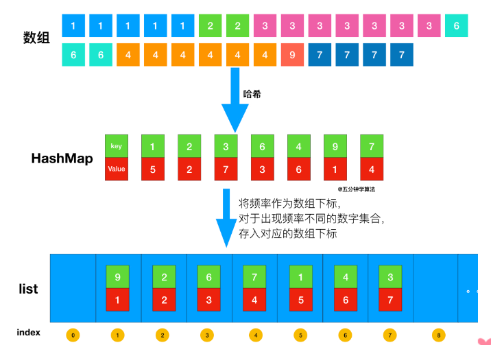
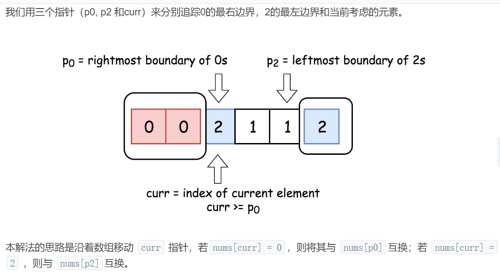
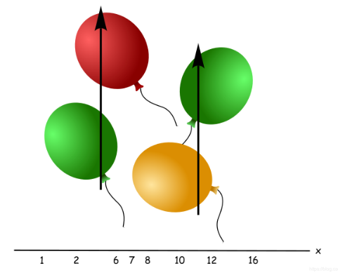
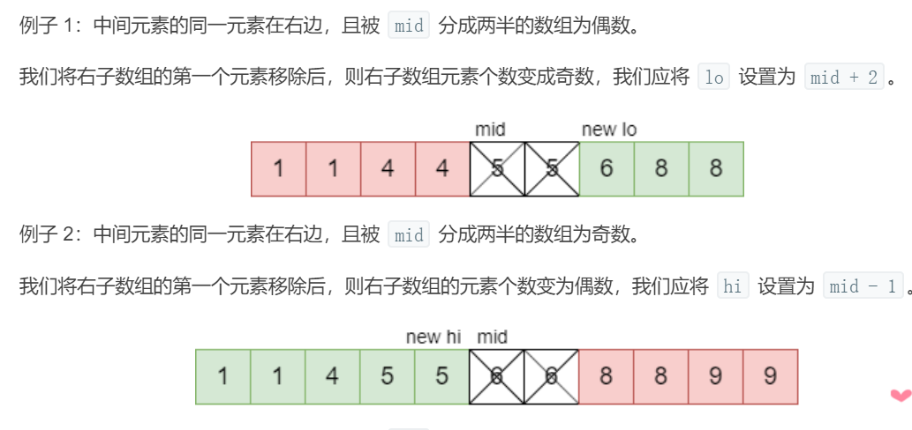
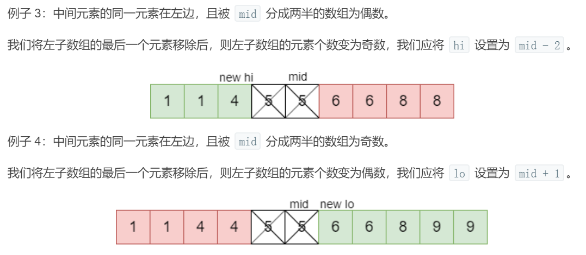
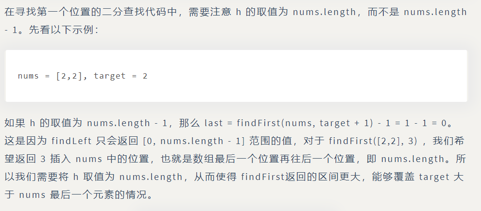

## 算法思想

### 双指针

#### 1.有序数组的two sum

```java
public int[] twoSum(int[] numbers, int target) {
    if (numbers == null) return null;
    int i = 0, j = numbers.length - 1;
    while (i < j) {
        int sum = numbers[i] + numbers[j];
        if (sum == target) {
            return new int[]{i + 1, j + 1};
        } else if (sum < target) {
            i++;
        } else {
            j--;
        }
    }
    return null;
}

```

夹逼

#### 2.两数平方和

本题的关键是右指针的初始化，实现剪枝，从而降低时间复杂度。设右指针为 x，左指针固定为 0，为了使 $0^2+x^2$的值尽可能接近 target，我们可以将 x 取为 sqrt(target)。

因为最多只需要遍历一次 0~sqrt(target)，所以时间复杂度为 O(sqrt(target))。又因为只使用了两个额外的变量，因此空间复杂度为 O(1)。

```java
 public boolean judgeSquareSum(int target) {
     if (target < 0) return false;
     int i = 0, j = (int) Math.sqrt(target);
     while (i <= j) {
         int powSum = i * i + j * j;
         if (powSum == target) {
             return true;
         } else if (powSum > target) {
             j--;
         } else {
             i++;
         }
     }
     return false;
 }

```

#### 3.反转字符串中的元音字符

使用双指针，一个指针从头向尾遍历，一个指针从尾到头遍历，当两个指针都遍历到元音字符时，交换这两个元音字符。

为了快速判断一个字符是不是元音字符，我们将全部元音字符添加到集合 HashSet 中，从而以 O(1) 的时间复杂度进行该操作。

时间复杂度为 O(N)：只需要遍历所有元素一次
空间复杂度 O(1)：只需要使用两个额外变量

```java
class Solution {
    private final static HashSet<Character> vowels = new HashSet<>(
        Arrays.asList('a', 'e', 'i', 'o', 'u', 'A', 'E', 'I', 'O', 'U'));
    public String reverseVowels(String s) {
        if (s == null) return null;
        int i = 0, j = s.length() - 1;
        char[] result = new char[s.length()];
        while (i <= j) {
            char ci = s.charAt(i);
            char cj = s.charAt(j);
            if (!vowels.contains(ci)) {
                result[i++] = ci;
            } else if (!vowels.contains(cj)) {
            result[j--] = cj;
            } else {
                result[i++] = cj;
                result[j--] = ci;
            }
        }
    return new String(result);
    }
}
```

用else if的原因是，result数组一个位置一轮只能赋一个值。正常情况每轮会往result填进2个值。

#### 4.回文字符串

因为只能删除一个（删左边指针往右指i+1，删右边指针往左指j-1），再判断指针中间的字符串是否是回文（isPanlindrome）

```java
class Solution {
    public boolean validPalindrome(String s) {
        for(int i=0,j=s.length()-1;i<j;i++,j--){
            if(s.charAt(i)!=s.charAt(j)){
                return isPalindrome(s,i+1,j) || isPalindrome(s,i,j-1);
            }
        }
        return true;
    }
    public boolean isPalindrome(String s,int i,int j){
        while(i<j){
            if(s.charAt(i++)!=s.charAt(j--)){
                return false;
            }
        }
        return true;
    }
}
```

#### 5.归并两个有序数组

需要从尾开始遍历，否则在 nums1 上归并得到的值会覆盖还未进行归并比较的值。

```java
class Solution {
    public void merge(int[] nums1, int m, int[] nums2, int n) {
        int index1=m-1,index2=n-1;
        int indexMerge=m+n-1;
        while(index1>=0||index2>=0){
            if(index1<0){  //nums1遍历完
                nums1[indexMerge--]=nums2[index2--];
            }
            else if(index2<0){  //nums2遍历完
                nums1[indexMerge--]=nums1[index1--];
            }
            else if(nums1[index1]>nums2[index2]){
                nums1[indexMerge--]=nums1[index1--];
            }
            else{
                nums1[indexMerge--]=nums2[index2--];
            }
        }
    }
}
```

#### 6.判断链表是否存在环

使用双指针，一个指针每次移动一个节点，一个指针每次移动两个节点，如果存在环，那么这两个指针一定会相遇。

```java
public boolean hasCycle(ListNode head) {
    if (head == null || head.next == null) {
        return false;
    }
    ListNode slow = head;
    ListNode fast = head.next; //注意初始化两个不能一样不然进不去while循环
    while (slow != fast) {
        if (fast == null || fast.next == null) {
            return false;
        }
        slow = slow.next;
        fast = fast.next.next;
    }
    return true;
}
```

#### 7.最长子序列

通过删除字符串 s 中的一个字符能得到字符串 t，可以认为 t 是 s 的子序列，我们可以使用双指针来判断一个字符串是否为另一个字符串的子序列。

```java
class Solution {
    public String findLongestWord(String s, List<String> d) {
        String LongestWord="";
        for(String target : d){
            int l1=LongestWord.length(),l2=target.length();
            if(l1>l2 || (l1==l2 && LongestWord.compareTo(target)<0)){ //这两种情况继续找：1.当前最优结果比target长 2.两者长度一样，但是当前最优结果的字典序更小。
                continue;
            }
            if(isSubString(target,s)){ //如果target是s的字串
                LongestWord=target;
            }
        }
        return LongestWord;
    }
    private boolean isSubString(String target,String s){
        int i=0,j=0;
        while(i<target.length() && j<s.length()){ //不一定i,j谁先走完
            if(target.charAt(i)==s.charAt(j)){
                i++;
            }
            j++;
        }
        return i==target.length();
    }
}
```

### 排序

#### 1.Kth Element

**排序** ：时间复杂度 O(NlogN)，空间复杂度 O(1)

```java
class Solution {
    public int findKthLargest(int[] nums, int k) {
        Arrays.sort(nums);
        return nums[nums.length-k];
    }
}
```

**堆** ：时间复杂度 O(NlogK)，调整小顶堆效率为logK,调整N次。空间复杂度 O(K)，不管源数据有多少，需要的内存开销是固定的，就是长度为K的数组。大顶堆：根最大，小顶堆：根最小。

PriorityQueue内部是用堆实现的，内部元素不是完全有序的，不过逐个出队会得到有序输出。

```java
class Solution {
    public int findKthLargest(int[] nums, int k) {
        PriorityQueue<Integer> pq=new PriorityQueue<>();//小顶堆
        for(int num:nums){
            pq.add(num);
            if(pq.size()>k){  //这个小顶堆是前k个最大元素，根节点是其中最小也就是第k大元素
                pq.poll();  //删除头部后，变成新的前k个最大元素（小的不断滚蛋）
            }
        }
        return pq.peek();
    }
}
```

**快速选择** ：时间复杂度 O(N)，空间复杂度 O(1)

用快排思想，每一次划分，pivot都被放到了正确的位置，左边比它小，右边比它大。这个位置比k小则在右边找，比k大则在左边找，等于k就是它。数组不用被排序完就可以找到升序中的某个位置。

第k大在升序数组中就是nums.length-k的位置

```java
public int findKthLargest(int[] nums, int k) {
    k = nums.length - k; //如果是第k小就没有这一步
    int l = 0, h = nums.length - 1;
    while (l < h) {
        int j = partition(nums, l, h);
        if (j == k) {
            break;
        } else if (j < k) {
            l = j + 1;
        } else {
            h = j - 1;
        }
    }
    return nums[k];
}

private int partition(int[] a, int l, int h) { //该函数将数组a划分为两部分，并返回中间pivot的正确位置
    int i = l, j = h + 1; //这么设初值和++i、--j有关
    while (true) {
        while (a[++i] < a[l] && i < h) ; //pivot直接选a[l]，比它小左边正常，直到不正常为止
        while (a[--j] > a[l] && j > l) ;
        if (i >= j) {
            break;
        }
        swap(a, i, j); //if a[i]>a[l]&&a[j]<a[l]
    }
    swap(a, l, j); //把pivot放回正确位置
    return j;
}

private void swap(int[] a, int i, int j) {
    int t = a[i];
    a[i] = a[j];
    a[j] = t;
}
```

#### 桶排序

#### 1.出现频率最多的k个元素



把数都放到桶之后，从后向前遍历桶，最先得到的 k 个数就是出现频率最多的的 k 个数。

```java
public List<Integer> topKFrequent(int[] nums, int k) {
    //创建哈希表，getOrDefault如果不存在key，返回其value值为默认，这里是0
    Map<Integer, Integer> frequencyForNum = new HashMap<>();
    for (int num : nums) {
        frequencyForNum.put(num, frequencyForNum.getOrDefault(num, 0) + 1);
    }
    //创建桶，例如3,4出现频率为7，下标7，里面为[3,4]
    List<Integer>[] buckets = new ArrayList[nums.length + 1];//这里长度为nums.length+1是所有元素都是一样的那频率就是nums.length，也是索引，然后index0是不用的所以加一
    for (int key : frequencyForNum.keySet()) {
        int frequency = frequencyForNum.get(key);
        if (buckets[frequency] == null) {
            buckets[frequency] = new ArrayList<>();//每个位置是list，因为可能有元素频率一样
        }
        buckets[frequency].add(key);
    }
    //得到结果
    List<Integer> topK = new ArrayList<>();
    for (int i = buckets.length - 1; i >= 0 && topK.size() < k; i--) {
        if (buckets[i] == null) {
            continue;
        }
        if (buckets[i].size() <= (k - topK.size())) {//若该频率的list小于剩下没填满的(k-topK.size())，直接全部填入
            topK.addAll(buckets[i]);
        } else {
            topK.addAll(buckets[i].subList(0, k - topK.size()));//否则只能填入部分，只能填入k-topk.size()大小。subList参数为下标，左开右闭
        }
    }
    return topK;
}
```

#### 2.按照字符出现次数对字符串排序

```java
class Solution {
    public String frequencySort(String s) {
        //前两步和上题一直，得到哈希频率表，并放入桶中
        Map<Character,Integer> frequencyFornum=new HashMap<>();
        for(char c:s.toCharArray()){
            frequencyFornum.put(c,frequencyFornum.getOrDefault(c,0)+1);
        }

        List<Character>[] bucket=new ArrayList[s.length()+1];
        for(char c: frequencyFornum.keySet()){
            int f=frequencyFornum.get(c);
            if(bucket[f]==null){
                bucket[f]=new ArrayList<>();
            }
            bucket[f].add(c);
        }

        StringBuilder str=new StringBuilder();
        for(int i=bucket.length-1;i>=0;i--){
            if(bucket[i]==null){
                continue;
            }
            for(char c:bucket[i]){
                for(int j=0;j<i;j++){ //一个字符频率为i，就要重复放入i次，caaa
                    str.append(c);
                }
            }
        }

        return str.toString();
    }
}
```

#### 荷兰国旗问题

#### 1.按颜色进行排序

**一次遍历**



设置3个指针，zero必须遍历到0，one必须是1，two必须是2才合理。这里边界和图上有一点点不同。

```java
class Solution {
    public void sortColors(int[] nums) {
        int zero=-1,one=0,two=nums.length;
        while(one<two){
            if(nums[one]==0){
                swap(nums,++zero,one++); //先更新边界
            }
            else if(nums[one]==2){
                swap(nums,--two,one); //为0交换one++而为2交换没有one++是因为：在第一种情况中，0放到前面，1,2放到后面的话one指针肯定会遍历到。第二种情况，2放到后面，0,1放到前面可能要再判断一次，有可能0还要提前，如果one++可能错过。
            }
            else
            {
                one++; //one指针指到1，很合理
            }
        }
    }
    private void swap(int[] nums,int i,int j){
        int temp=nums[i];
        nums[i]=nums[j];
        nums[j]=temp;
    }
}
```


### 贪心思想

#### 1.分配饼干

1.给一个孩子的饼干应当尽量小并且又能满足该孩子，这样大饼干才能拿来给满足度比较大的孩子。
2.因为满足度最小的孩子最容易得到满足，所以先满足满足度最小的孩子。

证明贪心是最优：

证明：假设在某次选择中，贪心策略选择给当前满足度最小的孩子分配第 m 个饼干，第 m 个饼干为可以满足该孩子的最小饼干。假设存在一种最优策略，可以给该孩子分配第 n 个饼干，并且 m < n。我们可以发现，经过这一轮分配，贪心策略分配后剩下的饼干一定有一个（比如n)比最优策略（比如m）来得大。因此在后续的分配中，贪心策略一定能满足更多的孩子。也就是说不存在比贪心策略更优的策略，即贪心策略就是最优策略。

```java
class Solution {
    public int findContentChildren(int[] g, int[] s) {
        if(g==null || s==null){return 0;}
        Arrays.sort(g);
        Arrays.sort(s);
        int gi=0,si=0;
        while(gi<g.length&&si<s.length){
            if(g[gi]<=s[si]){ //分配成功gi和si都++，不成功满足不了胃口就加大size即si++
                gi++;
            }
            si++;
        }
        return gi;
    }
}
```

#### 2.不重叠的区间个数

先计算**最多**能组成的不重叠区间个数(越多越好，这样最后要去除的就少），然后用区间总个数减去不重叠区间的个数。

在每次选择中，区间的结尾最为重要，选择的区间结尾越小，留给后面的区间的空间越大，那么后面能够选择的区间个数也就越大。

按区间的结尾进行排序，每次选择结尾最小，并且和前一个区间不重叠的区间。

```java
class Solution {
    public int eraseOverlapIntervals(int[][] intervals) {
        if(intervals.length==0){return 0;}
        Arrays.sort(intervals,Comparator.comparingInt(o->o[1])); //比较每个区间的1号元素
        int cnt=1; //初始不重叠区间个数，intervals[0]肯定是
        int end=intervals[0][1];
        for(int i=1;i<intervals.length;i++){
            if(intervals[i][0]<end){ //有重叠
                continue;
            }
            cnt++; //intervals[i]是
            end=intervals[i][1];
        }
        return intervals.length-cnt;
    }
}
```

#### 3.投飞镖刺破气球



就是求不重叠区间数，是个定值（与上题区别：上题要删一些得到不重叠）。不过[1, 2] 和 [2, 3] 在本题中算是重叠区间。

```java
class Solution {
    public int findMinArrowShots(int[][] points) {
        if(points.length==0){return 0;}
        Arrays.sort(points,Comparator.comparingInt(o->o[1]));
        int cnt=1,end=points[0][1];
        for(int i=1;i<points.length;i++){
            if(points[i][0]<=end){
                continue;
            }
            cnt++;
            end=points[i][1];
        }
        return cnt;
    }
}
```

#### 4.根据身高和序号重组队列

为了使插入操作不影响后续的操作，身高较高的学生应该先做插入操作，否则身高较小的学生原先正确插入的第 k 个位置可能会变成第 k+1 个位置。如果先插矮的，前面有一个人比他高，然后又插了一个高的在前面，这个矮的位置就不对了。但是先插高的，前面只能插更矮的，矮的不会影响这个高的的位置。

身高 h 降序、个数 k 值升序，然后将某个学生插入队列的第 k 个位置中。

```java
class Solution {
    public int[][] reconstructQueue(int[][] people) {
        if(people==null || people.length==0 || people[0].length==0){
            return new int[0][0];
        }
        Arrays.sort(people,(a,b)->(a[0]==b[0]?a[1]-b[1]:b[0]-a[0]));//如果身高等，则按k升序；不等按身高。
        List<int []> queue=new ArrayList<>();
        for(int [] p : people){
            queue.add(p[1],p);//位置p[1]插入p
        }
        return queue.toArray(new int[queue.size()][]);
    }
}
```

#### 5.买卖股票的最大收益

只要记录前面的最小价格，将这个最小价格作为买入价格，然后将当前的价格作为售出价格，查看当前收益是不是最大收益。

我们只需要遍历价格数组一遍，记录历史最低点，然后在每一天考虑这么一个问题：如果我是在历史最低点买进的，那么我今天卖出能赚多少钱？当考虑完所有天数之时，我们就得到了最好的答案。

```java
class Solution {
    public int maxProfit(int[] prices) {
        if(prices.length==0) return 0;
        int soFarMin=prices[0];
        int maxprofit=0;
        for(int i=1;i<prices.length;i++){
            if(soFarMin>prices[i]) soFarMin=prices[i]; //因为题目规定不能在买入前卖出，所以用if-else
            else maxprofit=Math.max(maxprofit,prices[i]-soFarMin);
        }
        return maxprofit;
    }
}
```

#### 6.买卖股票的最大收益 ||

对于 [a, b, c, d]，如果有 a <= b <= c <= d ，那么最大收益为 d - a。而 d - a = (d - c) + (c - b) + (b - a) ，因此当访问到一个 prices[i] 且 prices[i] - prices[i-1] > 0，那么就把 prices[i] - prices[i-1] 添加到收益中。有利润就吃。

```java
class Solution {
    public int maxProfit(int[] prices) {
       int profit=0;
       for(int i=1;i<prices.length;i++){
           if(prices[i]-prices[i-1]>0){
               profit+=(prices[i]-prices[i-1]);
           }
       } 
       return profit;
    }
}
```

#### 7.种植花朵

我们从左到右扫描数组 flowerbed，如果数组中有一个 0，并且这个 0 的左右两侧都是 0，那么我们就可以在这个位置种花，即将这个位置的 0 修改成 1，并将计数器 count 增加 1。对于数组的第一个和最后一个位置，我们只需要考虑一侧是否为 0。

在扫描结束之后，我们将 count 与 n 进行比较。如果 count >= n，那么返回 True，否则返回 False。

```java
class Solution {
    public boolean canPlaceFlowers(int[] flowerbed, int n) {
        int cnt=0;
        for(int i=0;i<flowerbed.length&&cnt<n;i++){ //cnt<n算是一个优化
            if(flowerbed[i]==1){
                continue;
            }
            int pre=(i==0?0:flowerbed[i-1]); //数组第一个位置，左侧看成0
            int next=(i==flowerbed.length-1?0:flowerbed[i+1]); //数组最后一个位置，右侧看成0
            if(pre==0 && next==0){
                cnt++;
                flowerbed[i]=1;
            }
        }
        return cnt>=n;
    }
}
```

#### 8.判断是否为子序列

如果是匹配一个较短字符串 **s** ，对于 **s**中每一个`char` 都优先匹配最开始遇到的，直接扫描一遍 **t** 即可

java中非常好的一个方法，indexOf(char c,int m)意思是从第m位置开始寻找该索引，找到则返回该索引，否则返回-1，利用该特性我们通过对索引处理从而获得解。

```java
class Solution {
    public boolean isSubsequence(String s, String t) {
        int index=-1;
        for(char c:s.toCharArray()){
            index=t.indexOf(c,index+1);
            if(index==-1) return false;
        }
        return true;
    }
}
```

#### 9.修改一个数成为非递减数组

i位置遍历完后要保证到nums[i]都是非递减的。在出现 nums[i] < nums[i - 1] 时，需要考虑的是应该修改数组的哪个数，使得本次修改能使 i 之前的数组成为非递减数组，并且 不影响后续的操作 。优先考虑（贪心）令 nums[i - 1] = nums[i]，缩小nums[i-1]，因为如果修改 nums[i] = nums[i - 1] 的话，那么 nums[i] 这个数会变大，就有可能比 nums[i + 1] 大，从而影响了后续操作。但前面还要判断一个比较特别的情况就是 nums[i] < nums[i - 2]，那么nums[i-1]>nums[i-2]，修改 nums[i - 1] = nums[i] 不能使数组成为非递减数组，没办法只能修改 nums[i] = nums[i - 1]。

```java
class Solution {
    public boolean checkPossibility(int[] nums) {
        int cnt=0;
        for(int i=1;i<nums.length&&cnt<2;i++){
            if(nums[i]>=nums[i-1]) continue;
            cnt++;
            if(i-2>=0&&nums[i]<nums[i-2]){
                nums[i]=nums[i-1];
            }
            else{
                nums[i-1]=nums[i];
            }
            
        }
        return cnt<=1;
    }
}
```

#### 10.子数组的最大和

贪心

如果 presum > 0，则说明 presum 对结果有增益效果，则 presum 保留并加上当前遍历数字
如果 presum <= 0，则说明 presum 对结果无增益效果，需要舍弃，则 presum 直接更新为当前遍历数字
每次比较 presum 和 maxSum的大小，将最大值置为maxsum，遍历结束返回结果

```java
class Solution {
    public int maxSubArray(int[] nums) {
        int preSum=nums[0];
        int maxSum=nums[0];
        for(int i=1;i<nums.length;i++){
            preSum=preSum>0?preSum+nums[i]:nums[i];
            maxSum=Math.max(preSum,maxSum);
        }
        return maxSum;
    }
}
```

动态规划（与贪心很像，用了一个dp表来存储每个位置的max，贪心不用）

```java
	public int maxSubArray(int[] nums) {
		int[] dp = new int[nums.length];
		dp[0] = nums[0];
		int max = nums[0];
		for (int i = 1; i < nums.length; i++) {
			dp[i] = Math.max(dp[i- 1] + nums[i], nums[i]);	
			if (max < dp[i]) {
				max = dp[i];
			}
		}
		return max;
	}
```

#### 11.分隔字符串使同种字符出现在一起

思路

策略就是不断地选择从最左边起最小的区间。可以从第一个字母开始分析，假设第一个字母是 'a'，那么第一个区间一定包含最后一次出现的 'a'。但第一个出现的 'a' 和最后一个出现的 'a' 之间可能还有其他字母，这些字母会让区间变大。举个例子，在 "abccaddbeffe" 字符串中，第一个最小的区间是 "abccaddb"。
通过以上的分析，我们可以得出一个算法：对于遇到的每一个字母，去找这个字母最后一次出现的位置，用来更新当前的最小区间。

算法

定义数组 last[char] 来表示字符 char 最后一次出现的下标。定义 anchor 和 j 来表示当前区间的首尾。如果遇到的字符最后一次出现的位置下标大于 j， 就让 j=last[c] 来拓展当前的区间。当遍历到了当前区间的末尾时(即 i==j )，把当前区间加入答案，同时将 start 设为 i+1 去找下一个区间。

```java
class Solution {
    public List<Integer> partitionLabels(String S) {
        int[] last=new int[26]; //26个英文字母
        for(int i=0;i<S.length();i++){
            last[S.charAt(i)-'a']=i; //相当于实现了一个字典，每个字母S.charAt(i)最后一次出现的位置
        }
        int anchor=0,j=0;
        List<Integer> res=new ArrayList<>();
        for(int i=0;i<S.length();i++){
            j=Math.max(j,last[S.charAt(i)-'a']);
            if(i==j){
                res.add(j-anchor+1); //长度要加一
                anchor=i+1;
            }
        }
        return res;
    }
}
```


### 二分查找

**正常实现**

```text
Input : [1,2,3,4,5]
key : 3
return the index : 2
```

```java
public int binarySearch(int[] nums, int key) {
    int l = 0, h = nums.length - 1;
    while (l <= h) {
        int m = l + (h - l) / 2;
        if (nums[m] == key) {
            return m;
        } else if (nums[m] > key) {
            h = m - 1;
        } else {
            l = m + 1;
        }
    }
    return -1;
}
```

**时间复杂度**

二分查找也称为折半查找，每次都能将查找区间减半，这种折半特性的算法时间复杂度为 O(logN)。

**m 计算**

有两种计算中值 m 的方式：

- m = (l + h) / 2
- m = l + (h - l) / 2       //注意不是(l+(h-l))/2

l + h 可能出现加法溢出，也就是说加法的结果大于整型能够表示的范围。但是 l 和 h 都为正数，因此 h - l 不会出现加法溢出问题。所以，最好使用第二种计算法方法。

**未成功查找的返回值**

循环退出时如果仍然没有查找到 key，那么表示查找失败。可以有两种返回值：

- -1：以一个错误码表示没有查找到 key
- l：将 key 插入到 nums 中的正确位置

**变种**

二分查找可以有很多变种，实现变种要注意边界值的判断。例如在一个有重复元素的数组中查找 key 的最左位置的实现如下：

```java
public int binarySearch(int[] nums, int key) {
    int l = 0, h = nums.length - 1;
    while (l < h) {
        int m = l + (h - l) / 2;
        if (nums[m] >= key) {
            h = m;
        } else {
            l = m + 1;
        }
    }
    return l;
}
```

该实现和正常实现有以下不同：

- h 的赋值表达式为 h = m
- 循环条件为 l < h
- 最后返回 l 而不是 -1

在 nums[m] >= key 的情况下，可以推导出最左 key 位于 [l, m] 区间中，这是一个闭区间。h 的赋值表达式为 h = m，因为 m 位置也可能是解。

在 h 的赋值表达式为 h = m 的情况下，如果循环条件为 l <= h，那么会出现循环无法退出的情况，因此循环条件只能是 l < h。以下演示了循环条件为 l <= h 时循环无法退出的情况：

```text
nums = {0, 1, 2}, key = 1
l   m   h
0   1   2  nums[m] >= key
0   0   1  nums[m] < key
1   1   1  nums[m] >= key
1   1   1  nums[m] >= key
...
```

当循环体退出时，不表示没有查找到 key，因此最后返回的结果不应该为 -1。为了验证有没有查找到，需要在调用端判断一下返回位置上的值和 key 是否相等。

#### 1.求开方

二分查找的下界为 0，上界可以粗略地设定为 x。在二分查找的每一步中，我们只需要比较中间元素 mid的平方与 x 的大小关系，并通过比较的结果调整上下界的范围。

```java
class Solution {
    public int mySqrt(int x) {
        int l=0,r=x;
        while(l<=r){
            int m=l+(r-l)/2; 
            if((long)m*m==x) return m;
            else if((long)m*m<x){
                l=m+1;
            }
            else{
                r=m-1;
            }
        }
        return r; //返回r因为跳出循环的时候l>r
    }
}
```

#### 2.大于给定元素的最小元素

```java
class Solution {
    public char nextGreatestLetter(char[] letters, char target) {
        int l=0,r=letters.length;
        while(l<r){
            int mid=l+(r-l)/2;
            if(letters[mid]<=target){
                l=mid+1;
            }
            else{ //注意这里mid>target有可能就是我们要的，所以只能r=mid，包括初始化r=letters.length也是这个原因
                r=mid;
            }
        }
        return l<letters.length?letters[l]:letters[0];
    }
}
```

#### 3.有序数组的Single Element

**包含单个元素的子数组元素个数必为奇数，不包含单个元素的子数组必为偶数。** 因此，当原数组移除一对元素后，然后计算出哪一侧的子数组元素个数是奇数，这样我们就能够知道下一步应该在哪一侧进行搜索。

我们首先将 lo 和 hi 指向数组首尾两个元素。然后进行二分搜索将数组搜索空间减半，直到找到单一元素或者仅剩一个元素为止。当搜索空间只剩一个元素，则该元素就是单个元素。
在每个循环迭代中，我们确定 mid，变量 halvesAreEven = (hi - mid) % 2 == 0。 通过查看中间元素同一元素为哪一个（左侧子数组中的最后一个元素或右侧子数组中的第一个元素），我们可以通过变量 halvesAreEven 确定现在哪一侧元素个数为奇数，并更新 lo 和 hi。
最难的部分是根据 mid 和 halvesAreEven 的值正确更新 lo 和 hi。我们通过下图来帮助我们理解。




```java
class Solution {
    public int singleNonDuplicate(int[] nums) {
        int low=0,high=nums.length-1;
        while(low<high){
            int mid=low+(high-low)/2;
            boolean RightAreEven=(high-mid)%2==0; //mid右边是奇是偶
            if(nums[mid]==nums[mid+1]){ //和右边一个等
                if(RightAreEven){ //右边是偶，删除一个后变奇，去右边
                    low=mid+2;
                }
                else{
                    high=mid-1; //右边是奇，删除一个后变偶，左边是奇，去左边
                }
            }
            else if(nums[mid]==nums[mid-1]){ //和左边一个等
                if(RightAreEven){ //右边是偶，去左边
                    high=mid-2;
                }
                else{
                    low=mid+1; //右边是奇，去右边
                }
            }
            else{
                return nums[mid];
            }
        }
        return nums[low];
    }
}
```

#### 4.第一个错误的版本

如果第 m 个版本出错，则表示第一个错误的版本在 [l, m] 之间，令 h = m；否则第一个错误的版本在 [m + 1, h] 之间，令 l = m + 1。

```java
public class Solution extends VersionControl {
    public int firstBadVersion(int n) {
        int l=1,r=n;
        while(l<r){
            int mid=l+(r-l)/2;
            if(isBadVersion(mid)){
                r=mid;
            }
            else{
                l=mid+1;
            }
        }
        return l;
    }
}
```

#### 5.旋转数组的最小数字

```java
class Solution {
    public int findMin(int[] nums) {
        int l=0,r=nums.length-1;
        while(l<r){
            int mid=l+(r-l)/2;
            if(nums[mid]<=nums[r]){
                r=mid;
            }
            else{
                l=mid+1;
            }
        }
        return nums[l];
    }
}
```

#### 6.查找区间

可以用二分查找找出第一个位置和最后一个位置，但是寻找的方法有所不同，需要实现两个二分查找。我们将寻找 target 最后一个位置，转换成寻找 target+1 第一个位置，再往前移动一个位置。这样我们只需要实现一个二分查找代码即可。

```java
class Solution {
    public int[] searchRange(int[] nums, int target) {
        int first=findFirst(nums,target);
        int last=findFirst(nums,target+1)-1;
        if(first==nums.length||nums[first]!=target){
            return new int[]{-1,-1};
        }
        else{
            return new int[]{first,last};
        }
    }

    private int findFirst(int[] nums,int target){
        int l=0,r=nums.length; //r初始值为nums.length主要是因为我们希望target+1后如果大于所有元素，返回nums.length。当然没找到可能返回中间的某个位置（单纯没找到），可能返回nums.length（大于所有元素），需要在调用端判断。
        while(l<r){
            int mid=l+(r-l)/2;
            if(nums[mid]>=target){
                r=mid;
            }
            else{
                l=mid+1;
            }
        }
        return l;
    }
}
```




### 分治思想

#### 1.给表达式加括号

可以通过运算符把整个式子分成两部分，两部分再利用递归解决。

以 2 * 3 - 4 * 5 为例。

2 和 3 - 4 * 5 两部分，中间是 * 号相连。

2 * 3 和 4 * 5 两部分，中间是 - 号相连。

2 * 3 - 4 和 5 两部分，中间是 * 号相连。

有了两部分的结果，然后再通过中间的符号两两计算加入到最终的结果中即可。

比如第一种情况，2 和 3 - 4 * 5 两部分，中间是 * 号相连。

2 的解就是 [2]，3 - 4 * 5 的解就是 [-5, -17]。

把两部分解通过 * 号计算，最终结果就是 [-10, -34]。

另外两种情况也类似。

然后还需要递归出口。

如果给定的字符串只有数字，没有运算符，那结果就是给定的字符串转为数字。

比如上边的第一种情况，2 的解就是 [2]。

```java
class Solution {
    public List<Integer> diffWaysToCompute(String input) {
        List<Integer> res=new ArrayList<>();
        for(int i=0;i<input.length();i++){
            char c=input.charAt(i);
            if(c=='+'||c=='-'||c=='*'){ //如果看到运算符就把表达式拆成两部分
                List<Integer> left_res=diffWaysToCompute(input.substring(0,i));
                List<Integer> right_res=diffWaysToCompute(input.substring(i+1));
                //左右结果组合
                for(int l:left_res){ //这里用了java的自动装箱拆箱机制（Java中基础数据类型与它们的包装类进行运算时，编译器会自动帮我们进行转换）
                    for(int r:right_res){
                        switch(c){
                            case '+': 
                                res.add(l+r);
                                break;
                            case '-':
                                res.add(l-r);
                                break;
                            case '*':
                                res.add(l*r);
                        }
                    }
                }
            }
        }
        if(res.size()==0) //如果只是单纯的数值
            res.add(Integer.valueOf(input));
        return res;
    }
}
```

#### 2.不同的二叉搜索树

```java
class Solution {
    public List<TreeNode> generateTrees(int n) {
        if(n<1)
            return new LinkedList<TreeNode>();
        return generateSubTrees(1,n);
    }

    private List<TreeNode> generateSubTrees(int start,int end){
        List<TreeNode> res=new LinkedList<>(); //这个列表里返回一堆root
        if(start>end){ //start==end不是空，有值的
            res.add(null);
            return res;
        }
        for(int i=start;i<=end;i++){ //轮流当root
            List<TreeNode> left_res=generateSubTrees(start,i-1); //左子树所有可能root
            List<TreeNode> right_res=generateSubTrees(i+1,end);
            for(TreeNode l:left_res)
                for(TreeNode r:right_res){
                    TreeNode root=new TreeNode(i);
                    root.left=l;
                    root.right=r;
                    res.add(root);
                }
        }
        return res;
    }
}
```