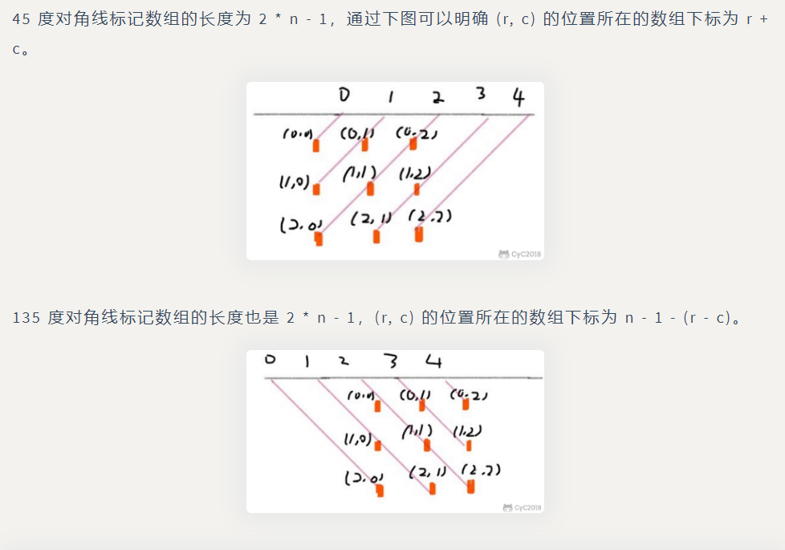

### 搜索

### BFS


广度优先搜索一层一层地进行遍历，每层遍历都是以上一层遍历的结果作为起点，遍历一个距离能访问到的所有节点。需要注意的是，遍历过的节点不能再次被遍历。

第一层：

- 0 -> {6,2,1,5}

第二层：

- 6 -> {4}
- 2 -> {}
- 1 -> {}
- 5 -> {3}

第三层：

- 4 -> {}
- 3 -> {}

每一层遍历的节点都与根节点距离相同。设 di 表示第 i 个节点与根节点的距离，推导出一个结论：对于先遍历的节点 i 与后遍历的节点 j，有 di <= dj。利用这个结论，可以求解最短路径等 **最优解** 问题：第一次遍历到目的节点，其所经过的路径为最短路径。应该注意的是，使用 BFS 只能求解无权图的最短路径，无权图是指从一个节点到另一个节点的代价都记为 1。

在程序实现 BFS 时需要考虑以下问题：

- 队列：用来存储每一轮遍历得到的节点；
- 标记：对于遍历过的节点，应该将它标记，防止重复遍历。

#### 1.计算在网格中从原点到特定点的最短路径长度

```java
class Solution {
    public int shortestPathBinaryMatrix(int[][] grid) {
        int[][] direction={{0,1},{0,-1},{-1,0},{1,0},{1,1},{1,-1},{-1,-1},{-1,1}};//八个方向比如往右上走就是{1,1}
        Queue<Pair<Integer,Integer>> q=new LinkedList<>();
        q.add(new Pair<>(0,0));
        int pathLength=0;
        int m=grid.length,n=grid[0].length;
        while(!q.isEmpty()){
            pathLength++;
            Queue<Pair<Integer,Integer>> next_q=new LinkedList<>();
            for(Pair<Integer,Integer> pair:q){ //相当于遍历当前层节点
                int cr=pair.getKey(),cc=pair.getValue();
                if(cr==m-1&&cc==n-1){
                    return pathLength;
                }
                if(grid[cr][cc]==1) continue; //有一开始就是1的情况
                grid[cr][cc]=1; //遍历过设置为1
                for(int[] d:direction){ //设置next_q
                    int nr=cr+d[0],nc=cc+d[1];
                    if(nr<0||nr>=m||nc<0||nc>=n||grid[nr][nc]==1) continue;
                    next_q.add(new Pair<>(nr,nc)); //满足条件的插入next_q
                }
            }
            q=next_q;        
        }
        return -1;
    }
}
```

#### 2.组成整数的最小平方数数量

可以将每个整数看成图中的一个节点，如果两个整数之差为一个完全平方数，那么这两个整数所在的节点就有一条边。

要求解最小的平方数数量，就是求解从节点 n 到节点 0 的最短路径。

```java
class Solution {
  public int numSquares(int n) {
	//生成<=n的完全平方数列表
    ArrayList<Integer> square_nums = new ArrayList<Integer>();
    for (int i = 1; i * i <= n; ++i) {
      square_nums.add(i * i);
    }
	//这里的队列用Set()是一个小技巧，就不用单独地marked数组标记是否访问过了，数字不会有重复的
    Set<Integer> queue = new HashSet<Integer>();
    queue.add(n);

    int level = 0;
    while (queue.size() > 0) {
      level += 1;
      Set<Integer> next_queue = new HashSet<Integer>(); //标志一层遍历完就新开一个next_queue的队列即可

      for (Integer remainder : queue) { //一般只要这个for就行，这里因为判断插入条件还需要一个for遍历square_nums
        for (Integer square : square_nums) { 
          if (remainder.equals(square)) {
            return level;
          } else if (remainder < square) { //即remainder-square<0那后面的square更大就不用遍历了
            break;
          } else {//相当于remainder和remainder-square之间有一条边
            next_queue.add(remainder - square);
          }
        }
      }
      queue = next_queue; //更新
    }
    return level;
  }
}

```

#### 3.最短单词路径

每个单词看成一个节点，求beginWord到endWord的最短路径，两个单词只差一个字母就算有边。

算法中最重要的步骤是找出相邻的节点，也就是只差一个字母的两个单词。为了快速的找到这些相邻节点，我们对给定的 wordList 做一个预处理，将单词中的某个字母用 * 代替。

这个预处理帮我们构造了一个单词变换的通用状态。例如：`Dog ----> D*g <---- Dig`，`Dog` 和 `Dig` 都指向了一个通用状态 `D*g`。

这步预处理找出了单词表中所有单词改变某个字母后的通用状态，并帮助我们更方便也更快的找到相邻节点。否则，对于每个单词我们需要遍历整个字母表查看是否存在一个单词与它相差一个字母，这将花费很多时间。

```java
class Solution {
    public int ladderLength(String beginWord, String endWord, List<String> wordList) {
    // Since all words are of same length.
    int L = beginWord.length();
        
    Map<String, List<String>> allComboDict = new HashMap<>();
    //建立字典，形如：{"*og":["log","cog","dog"]}
    wordList.forEach(
        word -> {
          for (int i = 0; i < L; i++) {
            String newWord = word.substring(0, i) + '*' + word.substring(i + 1, L);
            List<String> transformations = allComboDict.getOrDefault(newWord, new ArrayList<>());
            transformations.add(word);
            allComboDict.put(newWord, transformations);
          }
        });
    

    Set<String> queue=new HashSet<>();
    queue.add(beginWord);
    int level=0;

    // Visited to make sure we don't repeat processing same word. 可能endWord不在wordList里面，不加这个会死循环
    Map<String, Boolean> visited = new HashMap<>();
    visited.put(beginWord, true);

    while(!queue.isEmpty()){
        level++;
        Set<String> next_queue=new HashSet<>();
        for(String word:queue){ //遍历当前层，遍历到语句可以是空
            for(int i=0;i<L;i++){ //检查连接条件，是否有边。将当前word的所有通用状态对应的adjacentword加入next_queue，它们是当前word可以一步转换的，它们与当前word之间有边。
                String newWord=word.substring(0,i)+'*'+word.substring(i+1);
                for (String adjacentWord : allComboDict.getOrDefault(newWord, new ArrayList<>())){
                    if(adjacentWord.equals(endWord)){
                        return level+1;
                    }
                    if (!visited.containsKey(adjacentWord)){
                        visited.put(adjacentWord,true);
                        next_queue.add(adjacentWord);
                    }    
                }
            }
        }
        queue=next_queue;
    }
    return 0;
    }
}
```


### DFS

从一个节点出发，使用 DFS 对一个图进行遍历时，能够遍历到的节点都是从初始节点可达的，DFS 常用来求解这种 **可达性** 问题。

#### 1.查找最大的连通面积

递归写法：

```java
class Solution {
    private int m,n;
    private int[][] direction={{0,1},{0,-1},{-1,0},{1,0}};
    public int maxAreaOfIsland(int[][] grid) {
        m=grid.length;
        n=grid[0].length;
        int maxArea=0;
        for(int i=0;i<m;i++) //所有点当起点进行深搜
            for(int j=0;j<n;j++){
                maxArea=Math.max(maxArea,dfs(grid,i,j));
            }
        return maxArea;
    }

    private int dfs(int[][] grid,int i,int j){
        if(i<0||i>=m||j<0||j>=n||grid[i][j]==0) return 0;
        int area=1;
        grid[i][j]=0; //访问过置0
        for(int[] d:direction){
            area+=dfs(grid,i+d[0],j+d[1]); //当前点出发的面积，等于它的面积加上4个方向的面积
        }
        return area;
    }
}
```

栈写法：

```java
class Solution {
    public int maxAreaOfIsland(int[][] grid) {
        int[][] direction=new int[][]{{0,1},{0,-1},{-1,0},{1,0}};
        int maxArea=0;
        Stack<int[]> s=new Stack<>();
        for(int i=0;i<grid.length;i++){
            for(int j=0;j<grid[0].length;j++){
                int area=0;
                s.push(new int[]{i,j});
                while(!s.isEmpty()){
                    int[] p=s.pop(); //一样先判断头能不能走通
                    if(p[0]<0||p[0]>=grid.length||p[1]<0||p[1]>=grid[0].length||grid[p[0]][p[1]]==0) continue;
                    grid[p[0]][p[1]]=0;
                    area++;
                    for(int[] d:direction){
                        s.push(new int[]{p[0]+d[0],p[1]+d[1]});
                    }
                }
                maxArea=Math.max(maxArea,area);
            }
        }
        return maxArea;
    }
}
```

#### 2.矩阵中的连通分量数目

与上题类似，深搜将遍历过的改为0

```java
class Solution {
    private int m,n;
    private int[][] direction={{-1,0},{1,0},{0,1},{0,-1}};
    public int numIslands(char[][] grid) {
        if(grid.length==0||grid==null) return 0;
        m=grid.length;
        n=grid[0].length;
        int num=0;
        for(int i=0;i<m;i++)
            for(int j=0;j<n;j++){
                if(grid[i][j]=='1'){
                    num++;
                    dfs(grid,i,j);
                }
            }
        return num;     
    }
    private void dfs(char[][] grid,int i,int j){
        if(i<0||i>=m||j<0||j>=n||grid[i][j]=='0') return;
        grid[i][j]='0';
        for(int[] d:direction){
            dfs(grid,i+d[0],j+d[1]);
        }
    }
}
```

#### 3.好友关系的连通分量数目

深搜，dfs相当于一列一列的来

```java
class Solution {
    public int findCircleNum(int[][] M) {
        int num=0;
        boolean[] visited=new boolean[M.length];
        for(int i=0;i<M.length;i++){
            if(!visited[i]){
                num++;
                dfs(M,visited,i);
            }
        }
        return num;
    }

    private void dfs(int[][] M,boolean[] visited,int i){
        visited[i]=true;
        for(int j=0;j<M.length;j++){
            if(M[i][j]==1&&!visited[j]){
                dfs(M,visited,j);
            }
        }
    }
}
```

#### 4.填充封闭区域

先填充最外侧，剩下的就是里侧了。外层的'O'的连通分量都换成'T'。

```java
class Solution {
    private int m,n;
    private int[][] direction={{0,1},{0,-1},{-1,0},{1,0}};
    public void solve(char[][] board) {
        if(board==null || board.length==0) return;
        m=board.length;
        n=board[0].length;
        for(int i=0;i<m;i++){ //行在变
            dfs(board,i,0); //第一列
            dfs(board,i,n-1); //最后一列
        }
        for(int i=0;i<n;i++){
            dfs(board,0,i); //第一行
            dfs(board,m-1,i); //最后一行
        }
        for(int i=0;i<m;i++){
            for(int j=0;j<n;j++){
                if(board[i][j]=='T'){
                    board[i][j]='O';
                }
                else if(board[i][j]=='O'){
                    board[i][j]='X';
                }
            }
        }
    }
    private void dfs(char[][] board,int i,int j){
        if(i<0||i>=m||j<0||j>=n||board[i][j]!='O') return; //这里不能单用=='X'因为可能有些'O'已经被替换为'T'了
        board[i][j]='T';
        for(int[] d:direction){
            dfs(board,i+d[0],j+d[1]);
        }
    }
}
```

#### 5.能到达的太平洋和大西洋的区域

```java
class Solution {
    private int m, n; 
    private int[][] direction = {{0, 1}, {0, -1}, {1, 0}, {-1, 0}};

    public List<List<Integer>> pacificAtlantic(int[][] matrix) {
        List<List<Integer>> ret = new ArrayList<>();
        if (matrix == null || matrix.length == 0) {
            return ret;
        }

        m = matrix.length;
        n = matrix[0].length;
        
        boolean[][] canReachP = new boolean[m][n];
        boolean[][] canReachA = new boolean[m][n];

        for (int i = 0; i < m; i++) { //从边界逆流，相当于边界陆地一定能流到海洋
            dfs(i, 0, canReachP,matrix);
            dfs(i, n - 1, canReachA,matrix);
        }
        for (int i = 0; i < n; i++) {
            dfs(0, i, canReachP,matrix);
            dfs(m - 1, i, canReachA,matrix);
        }

        for (int i = 0; i < m; i++) {
            for (int j = 0; j < n; j++) {
                if (canReachP[i][j] && canReachA[i][j]) {
                    ret.add(Arrays.asList(i, j));
                }
            }
        }
        return ret;
    }

    private void dfs(int i, int j, boolean[][] canReach,int[][] matrix) {
        if(i<0||i>=m||j<0||j>=n||canReach[i][j]) return;
        canReach[i][j]=true;
        for(int[] d:direction){
            int next_i=i+d[0];
            int next_j=j+d[1];
            if(next_i<0||next_i>=m||next_j<0||next_j>=n||matrix[next_i][next_j]<matrix[i][j]){
                continue;
            }
            dfs(next_i,next_j,canReach,matrix);
        }
    }

}
```


### 回溯(Backtracking)

Backtracking（回溯）属于 DFS。

- 普通 DFS 主要用在 **可达性问题** ，这种问题只需要执行到特定的位置然后返回即可。
- 而 Backtracking 主要用于求解 **排列组合** 问题，例如有 { 'a','b','c' } 三个字符，求解所有由这三个字符排列得到的字符串，这种问题在执行到特定的位置返回之后还会继续执行求解过程。

因为 Backtracking 不是立即返回，而要继续求解，因此在程序实现时，需要注意对元素的标记问题：

- 在访问一个新元素进入新的递归调用时，需要将新元素标记为已经访问，这样才能在继续递归调用时不用重复访问该元素；
- 但是在递归返回时，需要将元素标记为未访问，因为只需要保证在一个递归链中不同时访问一个元素，可以访问已经访问过但是不在当前递归链中的元素。

#### 1.数字键盘组合

回溯是一种通过穷举所有可能情况来找到所有解的算法。如果一个候选解最后被发现并不是可行解，回溯算法会舍弃它，并在前面的一些步骤做出一些修改，并重新尝试找到可行解。

```java
class Solution {
    Map<String, String> phone = new HashMap<String, String>() {{
    put("2", "abc");
    put("3", "def");
    put("4", "ghi");
    put("5", "jkl");
    put("6", "mno");
    put("7", "pqrs");
    put("8", "tuv");
    put("9", "wxyz");
  }};
    List<String> res=new ArrayList<>();
    public List<String> letterCombinations(String digits) {
        if(digits.length()!=0){
            backtrack("",digits);
        }
        return res;
    }
    private void backtrack(String combination,String next_digits){
        if(next_digits.length()==0){ //应该是单用if要return，否则要if-else
            res.add(combination);
        }
        else{
            String digit=next_digits.substring(0,1); //当前数字串首位数字
            String letters=phone.get(digit); //这个数字对应的字符串
            for(int i=0;i<letters.length();i++){ //遍历字符串，取出每个字符与combination结合
                String letter=letters.substring(i,i+1);
                backtrack(combination+letter,next_digits.substring(1));
            }
        }
    }
}
```

#### 2.IP地址划分

```java
class Solution {
    int n;
    List<String> res=new ArrayList<>();
    LinkedList<String> segments=new LinkedList<>();
    String s;
    public List<String> restoreIpAddresses(String s) {
        this.s=s;
        n=s.length();
        backtrack(-1,3);
        return res;
    }
    private void backtrack(int pre_pos,int dots){ //pre_pos是前面一个点的位置，dots是当前要放的点的个数
        int max_pos=Math.min(pre_pos+4,n-1); //点不能放最后，也不能放pre_pos+4的位置
        for(int cur_pos=pre_pos+1;cur_pos<max_pos;cur_pos++){
            String segment=s.substring(pre_pos+1,cur_pos+1);//点放在数字后如0.
            if(valid(segment)){
                segments.add(segment);
                if(dots==1){ //相当于放完最后一个点了，处理最后一个segment
                    updateOutput(cur_pos);
                }
                else{
                    backtrack(cur_pos,dots-1);
                }
                segments.removeLast();//回退
            }
        }
    }
    private boolean valid(String segment){
        int m = segment.length();
        if (m > 3) //这个是为了处理最后一个segment
            return false;
        return (segment.charAt(0) != '0') ? (Integer.valueOf(segment) <= 255) : (m == 1); //以'0'开头必须是'0'
    }
    private void updateOutput(int cur_pos){
        String segment=s.substring(cur_pos+1);
        if(valid(segment)){
            segments.add(segment);
            res.add(String.join(".",segments));
            segments.removeLast(); //每加入一个segment都要回退
        }
    }
}
```

#### 3.在矩阵中寻找字符串

```java
class Solution {
    int m,n;
    int[][] direction={{0,1},{0,-1},{-1,0},{1,0}};
    public boolean exist(char[][] board, String word) {
        m=board.length;
        n=board[0].length;
        boolean[][] visited=new boolean[m][n];
        for(int i=0;i<m;i++){
            for(int j=0;j<n;j++){
                if(backtracking(0,i,j,board,word,visited)){
                    return true;
                }
            }
        }
        return false;
    }
    private boolean backtracking(int curLen,int i,int j,char[][] board,String word,boolean[][] visited){
        if(curLen==word.length()) return true; //这里已经是匹配完成后再往下一步了
        if(i<0||i>=m||j<0||j>=n||visited[i][j]||word.charAt(curLen)!=board[i][j]) return false;
        visited[i][j]=true;
        for(int[] d:direction){
            if(backtracking(curLen+1,i+d[0],j+d[1],board,word,visited)) return true;
        }
        visited[i][j]=false; //状态恢复
        return false;
    }
}
```

#### 4.二叉树的所有路径

```java
class Solution {
    public void construct_paths(TreeNode root, String path, LinkedList<String> paths) {
        if (root != null) {
            path += Integer.toString(root.val);
            if ((root.left == null) && (root.right == null))  // 当前节点是叶子节点
                paths.add(path);  // 把路径加入到答案中
            else {
                path += "->";  // 当前节点不是叶子节点，继续递归遍历
                construct_paths(root.left, path, paths);
                construct_paths(root.right, path, paths);
            }
        }
    }

    public List<String> binaryTreePaths(TreeNode root) {
        LinkedList<String> paths = new LinkedList();
        construct_paths(root, "", paths);
        return paths;
    }
}
```

#### 5.全排列

```java
class Solution {
    public List<List<Integer>> permute(int[] nums) {
        List<Integer> permuteList=new ArrayList<>();
        List<List<Integer>> res=new ArrayList<>();
        boolean[] visited=new boolean[nums.length];
        backtracking(permuteList,res,nums,visited);
        return res;
    }
    private void backtracking(List<Integer> permuteList,List<List<Integer>> res,int[] nums,boolean[] visited){
        if(permuteList.size()==nums.length){
            res.add(new ArrayList<>(permuteList)); //这里添加的是permuteList的拷贝，如果add(permuteList)是添加引用，是空。我们需要某个特定时期的内容
            return;//一步步返回到根节点，permuteList是空的
        }
        for(int i=0;i<nums.length;i++){
            if(visited[i]) continue;
            visited[i]=true;
            permuteList.add(nums[i]);
            backtracking(permuteList,res,nums,visited);
            permuteList.remove(permuteList.size()-1); //为返回上一节点做准备
            visited[i]=false;
        }

    }
}
```

.assets/image-20200622105625751.png)

#### 6.含有相同元素求排列

在实现上，和 Permutations 不同的是要先排序，然后在添加一个元素时，判断这个元素是否等于前一个元素，如果等于，并且前一个元素还未访问，那么就跳过这个元素。

.assets/image-20200623154639046.png)

相当于要剪枝：剪掉与上一次搜索起点相同的。因为上一次相同起点搜索完了之后被撤销（visited被重置为false，所以!visited[i-1])

```java
class Solution {
    public List<List<Integer>> permuteUnique(int[] nums) {
        List<List<Integer>> permute=new ArrayList<>();
        List<Integer> permuteList=new ArrayList<>();
        boolean[] visited=new boolean[nums.length];
        Arrays.sort(nums);
        backtracking(permute,permuteList,visited,nums);
        return permute;
    }
    private void backtracking(List<List<Integer>> permute,List<Integer> permuteList,boolean[] visited,int[] nums){
        if(permuteList.size()==nums.length){
            permute.add(new ArrayList<>(permuteList));
            return;
        }
        for(int i=0;i<nums.length;i++){
            if(i!=0&&nums[i]==nums[i-1]&&!visited[i-1]){
                continue;
            }
            if(visited[i]){
                continue;
            }
            permuteList.add(nums[i]);
            visited[i]=true;
            backtracking(permute,permuteList,visited,nums);
            permuteList.remove(permuteList.size()-1);
            visited[i]=false;
        }
    }
}
```

#### 7.组合

```java
class Solution {
    List<List<Integer>> combinations=new ArrayList<>();

    public List<List<Integer>> combine(int n, int k) {
        List<Integer> combineList=new ArrayList<>();
        backtracking(1,combineList,n,k);
        return combinations;
    }
    private void backtracking(int start,List<Integer> combineList,int n,int k){
        if(k==0){
            combinations.add(new ArrayList<>(combineList));
            return;
        }
        for(int i=start;i<=n-k+1;i++){ //这里剪枝了：比如1已经抽了，[2,3,4,5]，假设还要抽2个实际i只能到4(5-2+1)
            combineList.add(i); //抽出来与前面组合进行组合
            backtracking(i+1,combineList,n,k-1);
            combineList.remove(combineList.size()-1);
        }
    }
}
```

#### 8.组合求和

```java
class Solution {
    List<List<Integer>> combinations=new ArrayList<>();
    public List<List<Integer>> combinationSum(int[] candidates, int target) {
        List<Integer> combination=new ArrayList<>();
        Arrays.sort(candidates); //注意要剪枝就要先sort
        backtracking(combination,candidates,0,target);
        return combinations;
    }
    private void backtracking(List<Integer> combination,int[] candidates,int start,int target){
        if(target==0){
            combinations.add(new ArrayList<>(combination));
            return;
        }
        for(int i=start;i<candidates.length;i++){ //i=start是因为数字可以重复用
            if(candidates[i]>target){ //后面大的可以剪掉
                return;
            }
            else{
                combination.add(candidates[i]);
                backtracking(combination,candidates,i,target-candidates[i]);
                combination.remove(combination.size()-1);
            }
        }
    }
}
```

#### 9.含有相同元素组合求和

```java
class Solution {
    List<List<Integer>> combinations=new ArrayList<>();
    public List<List<Integer>> combinationSum2(int[] candidates, int target) {
        List<Integer> combination=new ArrayList<>();
        boolean[] visited=new boolean[candidates.length];
        Arrays.sort(candidates);
        backtracking(combination,candidates,0,target,visited);
        return combinations;
    }
    private void backtracking(List<Integer> combination,int[] candidates,int start,int target,boolean[] visited){
        if(target==0){
            combinations.add(new ArrayList<>(combination));
            return;
        }
        for(int i=start;i<candidates.length;i++){
            if(i>0&&candidates[i]==candidates[i-1]&&!visited[i-1]){ //这里作用是结果集去重，比如排好序[1,1,2,5,6,7,10]，这里不判断结果集会有重复
                continue;
            }
            if(candidates[i]>target){ //剪枝
                return;
            }
            else{
                combination.add(candidates[i]);
                visited[i]=true;
                backtracking(combination,candidates,i+1,target-candidates[i],visited); //这题每个数字只能用一次所以start传i+1
                visited[i]=false;
                combination.remove(combination.size()-1);
            }
        }
    }
}
```

#### 10.1-9数字的组合求和

```java
class Solution {
    List<List<Integer>> combinations=new ArrayList<>();
    public List<List<Integer>> combinationSum3(int k, int n) {
        List<Integer> combination=new ArrayList<>();
        backtracking(combination,1,k,n);
        return combinations;
    }
    private void backtracking(List<Integer> combination,int start,int k,int n){
        if(k==0&&n==0){
            combinations.add(new ArrayList<>(combination));
            return;
        }
        if(k==0||n==0){ //剪枝，比如已经n=0，但是还没抽完就不用再抽了。可以不要
            return;
        }
        for(int i=start;i<=9-k+1;i++){ //抽取的小剪枝，与组合第一题同
            if(i>n){ //剪枝
                return;
            }
            else{
                combination.add(i);
                backtracking(combination,i+1,k-1,n-i);
                combination.remove(combination.size()-1);
            }
        }
    }
}
```

#### 11.子集

```java
class Solution {
    List<List<Integer>> combinations=new ArrayList<>();
    public List<List<Integer>> subsets(int[] nums) {
        List<Integer> combination=new ArrayList<>();
        for(int size=0;size<=nums.length;size++){ //原先的题是固定抽k个，这里就是按子集大小长度遍历
            backtracking(combination,nums,0,size);
        }
        return combinations;
    }
    private void backtracking(List<Integer> combination,int[] nums,int start,int size){
        if(combination.size()==size){
            combinations.add(new ArrayList<>(combination));
            return;
        }
        for(int i=start;i<nums.length;i++){
            combination.add(nums[i]);
            backtracking(combination,nums,i+1,size);
            combination.remove(combination.size()-1);
        }
    }
}
```

#### 12.含有相同元素求子集

含有相同元素结果集可能会有重复所以要去重

```java
class Solution {
    List<List<Integer>> combinations=new ArrayList<>();
    public List<List<Integer>> subsetsWithDup(int[] nums) {
        List<Integer> combination=new ArrayList<>();
        boolean[] visited=new boolean[nums.length];
        Arrays.sort(nums); //不要忘记sort
        for(int size=0;size<=nums.length;size++){
            backtracking(combination,nums,visited,0,size);
        }
        return combinations;
    }
    private void backtracking(List<Integer> combination,int[] nums,boolean[] visited,int start,int size){
        if(combination.size()==size){
            combinations.add(new ArrayList<>(combination));
            return;
        }
        for(int i=start;i<nums.length;i++){
            if(i>0&&nums[i]==nums[i-1]&&!visited[i-1]){ //去结果集重复，也算是剪枝
                continue;
            }
            combination.add(nums[i]);
            visited[i]=true;
            backtracking(combination,nums,visited,i+1,size);
            visited[i]=false;
            combination.remove(combination.size()-1);
        }
    }
}
```

#### 13.分割回文串

不断切s的左边，左边切下来是就加入temp，backtracking s的右边。s逐渐变短。好像都是把右边给下一个backtracking，左边加暂时的结果集。

```java
class Solution {
    List<List<String>> res=new ArrayList<>();
    public List<List<String>> partition(String s) {
        List<String> temp=new ArrayList<>();
        backtracking(s,temp);
        return res;
    }
    private void backtracking(String s,List<String> temp){
        if(s.length()==0){
            res.add(new ArrayList<>(temp));
            return;
        }
        for(int i=0;i<s.length();i++){
            if(isPalindrome(s,0,i)){
                temp.add(s.substring(0,i+1));
                backtracking(s.substring(i+1),temp);
                temp.remove(temp.size()-1);
            }
        }
    }
    private boolean isPalindrome(String s,int begin,int end){
        while(begin<end){
            if(s.charAt(begin++)!=s.charAt(end--)){
                return false;
            }
        }
        return true;
    }
}
```

#### 14.数独

.assets/image-20200626170718224.png)

.assets/image-20200626170738365.png)

```java
class Solution {
    int[][] rows=new int[9][10];
    int[][] cols=new int[9][10];
    int[][] boxes=new int[9][10];
    char[][] board;
    public void solveSudoku(char[][] board) {
        this.board=board;
        for(int i=0;i<9;i++){ //初始化状态，要得到初始的约束条件。因为原先board里面就有一些数是填好的
            for(int j=0;j<9;j++){
                if(board[i][j]!='.'){
                    int num=board[i][j]-'0';
                    PlaceNum(num,i,j);
                }
            }
        }
        backtracking(0,0);
    }
    private void PlaceNum(int num,int row,int col){
        int box_id=(row/3)*3+col/3;
        rows[row][num]++;
        cols[col][num]++;
        boxes[box_id][num]++;
        board[row][col]=(char)(num+'0');
    }
    private void RemoveNum(int num,int row,int col){
        int box_id=row/3*3+col/3;
        rows[row][num]--;
        cols[col][num]--;
        boxes[box_id][num]--;
        board[row][col]='.';
    }
    private boolean CouldPlace(int num,int row,int col){
        int box_id=row/3*3+col/3;
        return rows[row][num]+cols[col][num]+boxes[box_id][num]==0;
    }
    private boolean backtracking(int row,int col){
        while(row<9&&board[row][col]!='.'){ //直接定位到下一个要放数的位置
            row=col==8?row+1:row;
            col=col==8?0:col+1;
        }
        if(row==9) return true;
        for(int num=1;num<10;num++){
            if(CouldPlace(num,row,col)){
                PlaceNum(num,row,col);
                if(backtracking(row,col)){ //这个结果返回true就代表能解决，返回的时候不用把已经填了数的又变回'.'
                    return true;
                }
                RemoveNum(num,row,col);
            }
        }
        return false;
    }
}
```

#### 15.N皇后



比如图中对角线数量5=2*3-1。45度r+c为常数，第一条：0+1。135度r-c为常数，第0条：3-1-(2-0)。

```java
class Solution {
    private List<List<String>> res=new ArrayList<>();
    private char[][] board;
    private boolean[] diagonals45Used; //45度某一条是不是已经使用
    private boolean[] diagonals135Used;
    private boolean[] colsUsed; //某一列是不是已经使用
    private int n;
    public List<List<String>> solveNQueens(int n) {
        this.n=n;
        board=new char[n][n];
        colsUsed=new boolean[n];
        diagonals45Used=new boolean[2*n-1];
        diagonals135Used=new boolean[2*n-1];
        for(int i=0;i<n;i++){ //char数组所有先初始化为'.'
            Arrays.fill(board[i],'.');
        }
        backtrack(0);
        return res;
    }

    private void backtrack(int row){
        if(row==n){ //找到一个解
            List<String> list=new ArrayList<>();
            for(char[] ch:board){
                list.add(new String(ch));
            }
            res.add(list);
            return;
        }
        for(int col=0;col<n;col++){ //只需遍历列
            if(CanPlace(row,col)){
                Place(row,col);
                backtrack(row+1);
                Remove(row,col);
            }
        }
    }
    private boolean CanPlace(int row,int col){ //判断是否能放置在(row,col)
        int Idx45=row+col;
        int Idx135=n-1-(row-col);
        if(colsUsed[col]||diagonals45Used[Idx45]||diagonals135Used[Idx135]) return false;
        return true;
    }
    private void Place(int row,int col){ //放置在(row,col)
        int Idx45=row+col;
        int Idx135=n-1-(row-col);
        colsUsed[col]=true;
        diagonals45Used[Idx45]=true;
        diagonals135Used[Idx135]=true;
        board[row][col]='Q';
    }
    private void Remove(int row,int col){ //移除(row,col)位置
        int Idx45=row+col;
        int Idx135=n-1-(row-col);
        colsUsed[col]=false;
        diagonals45Used[Idx45]=false;
        diagonals135Used[Idx135]=false;
        board[row][col]='.';
    }
}
```


