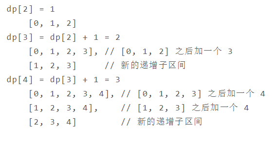
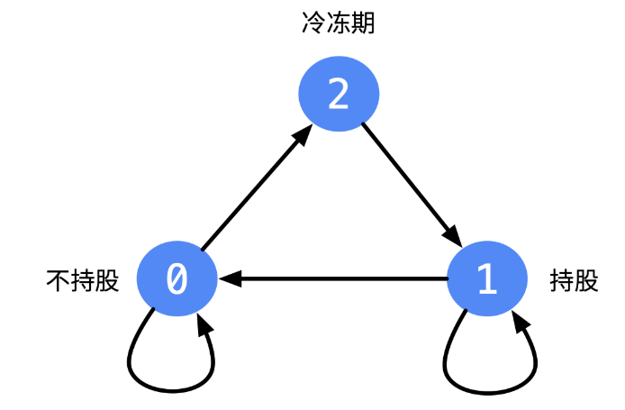

### 动态规划

#### 斐波那契数列

#### 1.爬楼梯

```java
class Solution {
    public int climbStairs(int n) {
        if(n<=2) return n;
        int pre1=1,pre2=2;
        int cur=0;
        for(int i=2;i<n;i++){
            cur=pre1+pre2;
            pre1=pre2;
            pre2=cur;
        }
        return cur;
    }
}
```

#### 2.强盗抢劫


```java
class Solution {
    public int rob(int[] nums) {
        int pre1=0,pre2=0; //顺序是pre1,pre2,cur
        int cur=0;
        for(int i=0;i<nums.length;i++){
            cur=Math.max(pre1+nums[i],pre2);
            pre1=pre2;
            pre2=cur;
        }
        return cur;
    }
}
```

#### 3.强盗在环形街区抢劫

与前面差不多，无非就是你要么抢(0~n-2)，要么抢(1~n-1)，因为第一个房子和最后一个房子相接

```java
class Solution {
    public int rob(int[] nums) {
        int n=nums.length;
        if(n==1) return nums[0];
        return Math.max(rob(nums,0,n-2),rob(nums,1,n-1));
    }
    private int rob(int[] nums,int start,int end){
        int pre1=0,pre2=0;
        int cur=0;
        for(int i=start;i<=end;i++){
            cur=Math.max(pre1+nums[i],pre2);
            pre1=pre2;
            pre2=cur;
        }
        return cur;
    }
}
```

#### 矩阵路径

#### 1.矩阵的最小路径和 

直接用原数组grid充当dp数组，因为不会往回走。

```java
class Solution {
    public int minPathSum(int[][] grid) {
        for(int i=0;i<grid.length;i++){
            for(int j=0;j<grid[0].length;j++){
                if(i==0&&j==0) continue; //[0][0]
                else if(i==0) grid[i][j]+=grid[i][j-1]; //上边界，只能从左边来
                else if(j==0) grid[i][j]+=grid[i-1][j]; //左边界，只能从上面来
                else grid[i][j]+=Math.min(grid[i][j-1],grid[i-1][j]); //对于普通的dp[i][j]=dp[i][j]+min(上，左)
            }
        }
        return grid[grid.length-1][grid[0].length-1];
    }
}
```

#### 2.矩阵的总路径数

```java
class Solution {
    public int uniquePaths(int m, int n) {
        int[][] dp=new int[m][n];
        for(int i=0;i<m;i++) dp[i][0]=1; //初始化左边界
        for(int j=0;j<n;j++) dp[0][j]=1; //初始化右边界
        for(int i=1;i<m;i++){
            for(int j=1;j<n;j++){
                dp[i][j]=dp[i-1][j]+dp[i][j-1];
            }
        }
        return dp[m-1][n-1];
    }
}
```

优化：每次循环左边的已经被计算了，当前存储的是上面来的

```java
class Solution {
    public int uniquePaths(int m, int n) {
        int[] cur = new int[n];
        Arrays.fill(cur,1);
        for (int i = 1; i < m;i++){
            for (int j = 1; j < n; j++){
                cur[j] += cur[j-1] ;
            }
        }
        return cur[n-1];
    }
}
```

也可以用数学来解：曼哈顿距离.assets/image-20200628183025549.png)

```java
public int uniquePaths(int m, int n) {
    int S = m + n - 2;  // 总共的移动次数
    int D = m - 1;      // 向下的移动次数
    long ret = 1;
    for (int i = 1; i <= D; i++) { //S乘D次除以D的阶乘
        ret = ret * (S - D + i) / i;
    }
    return (int) ret;
}

```

#### 数组区间

#### 1.数组区间和

.assets/image-20200629101935710.png)

sumrange(2,5)=sum(6)-sum(2)，计算的是下标为2,3,4,5的和，sum(6) 0-5 sum(2) 0-1

```java
class NumArray {
    private int[] sum;
    public NumArray(int[] nums) {
        sum=new int[nums.length+1];
        for(int i=1;i<sum.length;i++){
            sum[i]=sum[i-1]+nums[i-1];
        }
    }
    
    public int sumRange(int i, int j) {
        return sum[j+1]-sum[i];
    }
}
```

#### 2.数组中等差递增子区间的个数



```java
class Solution {
    public int numberOfArithmeticSlices(int[] A) {
        int[] dp=new int[A.length]; //dp[i]表示以A[i]结尾的子等差数列的个数
        int sum=0;
        for(int i=2;i<dp.length;i++){
            if(A[i]-A[i-1]==A[i-1]-A[i-2]){
                dp[i]=dp[i-1]+1;  //前面子等差数列加上A[i]也是等差数列，数量为dp[i-1]。再加一：[A[i-2],A[i-1],A[i]]
                sum+=dp[i];
            }
        }
        return sum;
    }
}
```

#### 分割整数

#### 1.分割整数的最大乘积

.assets/image-20200629112246406.png)

```java
class Solution {
    public int integerBreak(int n) {
        int[] dp=new int[n+1]; //dp[i]代表整数i最好结果，将整数i分为j和i-j两部分。
        Arrays.fill(dp,1);
        for(int i=3;i<=n;i++){
            for(int j=1;j<i;j++){
                dp[i]=Math.max(dp[i],Math.max(j*(i-j),j*dp[i-j])); //有可能(i-j)>dp[i-j]，所以dp[i]有三个来源
            }
        }
        return dp[n];
    }
}
```

#### 2.完全平方数（贪心+BFS做过）

```java
class Solution {
    public int numSquares(int n) {
        //产生<=n的完全平方数列表
        List<Integer> square_list=new ArrayList<>();
        for(int i=1;i*i<=n;i++){
            square_list.add(i*i);
        }
        int[] dp=new int[n+1];
        for(int i=1;i<n+1;i++){
            int min=Integer.MAX_VALUE;
            //对于n前每一个数i，dp储存最优结果：和为i的完全平方数的最少个数
            for(int square:square_list){
                if(square>i) break;
                min=Math.min(min,dp[i-square]+1); //要得到最优，不断刷新min。相当于dp[i]=所有dp[i-sqaure]+1中最小
            }
            dp[i]=min;
        }
        return dp[n];
    }
}
```

#### 3.解码方法

.assets/image-20200630165246995.png)

```java
class Solution {
    public int numDecodings(String s) {
        int n=s.length();
        int[] dp=new int[n+1]; //dp[i]存储到i位置之前的解码数
        dp[0]=1;
        dp[1]=s.charAt(0)=='0'?0:1;
        for(int i=2;i<=n;i++){
            int one=Integer.valueOf(s.substring(i-1,i));
            if(one!=0){ //s[i-1]单独解码，为dp[i-1]
                dp[i]=dp[i-1];
            }
            if(s.charAt(i-2)=='0') continue;
            int two=Integer.valueOf(s.substring(i-2,i));
            if(two<=26){  //s[i-2]和s[i-1]合并解码，为dp[i-2]
                dp[i]+=dp[i-2];
            }
        }
        return dp[n];
    }
}
```

#### 最长递增子序列

#### 1.最长递增子序列

动态规划：

如果满足j<i且nums[j]<nums[i]，那么以nums[j]结尾的递增子序列加上nums[i]又变成新的递增子序列。复杂度O($N^2$)

```java
class Solution {
    public int lengthOfLIS(int[] nums) {
        if(nums.length==0) return 0;
        int res=1;
        int[] dp=new int[nums.length];
        dp[0]=1;
        for(int i=1;i<nums.length;i++){ //对于每一个以nums[i]结尾的
            int max=1; //只有一个数字长度就是1，最小是1
            for(int j=0;j<i;j++){ //dp[i]=所有dp[j]+1中最大的
                if(nums[j]<nums[i]){
                    max=Math.max(max,dp[j]+1);
                }
            }
            dp[i]=max; //dp[i]是以nums[i]结尾的最长递增子序列长度
            res=Math.max(dp[i],res); //从整体上看，要找dp数组最大的，因为不一定当前以nums[i]结尾的就最大最长
        }
        return res;
    }
}
```

贪心+二分查找，复杂度O(NlogN)。维护一个tail数组，其长度len就是结果。如果num比tail里面都大，则len++。否则，将num替换到tail中合适位置，对序列长度没有影响。贪心的点在于：如果我们要使上升子序列尽可能的长，则我们需要让序列上升得尽可能慢，因此我们希望每次在上升子序列最后加上的那个数尽可能的小，num的替换就是为了这个，万一替换的是tail[-1]。注意tail不是最终的递增子序列。

.assets/image-20200701161238146.png)

```java
class Solution {
    public int lengthOfLIS(int[] nums) {
        int[] tail=new int[nums.length];
        int len=0;
        for(int num:nums){
            int index=binarysearch(tail,num,len);
            tail[index]=num;
            if(index==len){
                len++;
            }
        }
        return len;
    }
    private int binarysearch(int[] tail,int num,int len){
        int l=0,h=len; //这里找不到会返回len
        while(l<h){
            int mid=l+(h-l)/2;
            if(tail[mid]>=num){
                h=mid;
            }
            else{
                l=mid+1;
            }
        }
        return l;
    }
}
```

#### 2.最长数对链

**动态规划**

与上题类似，只是可以以任何顺序选择其中的一些数对来构造，所以要先排序

```java
class Solution {
    public int findLongestChain(int[][] pairs) {
        Arrays.sort(pairs,(a,b)->(a[0]-b[0]));
        int[] dp=new int[pairs.length];
        dp[0]=1;
        int res=0;
        for(int i=1;i<pairs.length;i++){
            int max=1;
            for(int j=0;j<i;j++){
                if(pairs[j][1]<pairs[i][0]){ //类似于上题的nums[j]<nums[i]。还要判断一下能不能组成链，因为排序只比较了数对的第一个元素
                    max=Math.max(max,dp[j]+1);
                }
            }
            dp[i]=max;
            res=Math.max(dp[i],res);
        }
        return res;
    }
}
```

**贪心**

在所有可作为下一个数对的集合中选择第二个数最小的数对添加到数对链。

```java
class Solution {
    public int findLongestChain(int[][] pairs) {
        Arrays.sort(pairs,(a,b)->(a[1]-b[1])); //这样排序选取时数对第二个数尽可能小，区间尽可能小
        int end=Integer.MIN_VALUE,count=0;
        for(int[] pair:pairs){
            if(end<pair[0]){ //当前pair可添加进数对链
                end=pair[1]; //更新end
                count++;
            }
        }
        return count;
    }
}
```

#### 3.最长摆动子序列

up记录当前尾巴上升的最长子序列长度，down记录当前尾巴下降的最长子序列长度。当前大于前面一个数，up=down+1;否则down=up+1。

```java
class Solution {
    public int wiggleMaxLength(int[] nums) {
        if(nums==null||nums.length==0) return 0;
        int up=1,down=1;
        for(int i=1;i<nums.length;i++){
            if(nums[i]>nums[i-1]){
                up=down+1;
            }
            else if(nums[i]<nums[i-1]){
                down=up+1;
            }
        }
        return Math.max(up,down);
    }
}
```


#### 最长公共子序列

#### 1.最长公共子序列

.assets/image-20200710180208526.png)


对于两个子序列 S1 和 S2，找出它们最长的公共子序列。

定义一个二维数组 dp 用来存储最长公共子序列的长度，其中 dp[i] [j] 表示 S1 的前 i 个字符与 S2 的前 j 个字符最长公共子序列的长度。考虑 S1i 与 S2j 值是否相等，分为两种情况：

- 当 S1i==S2j 时，那么就能在 S1 的前 i-1 个字符与 S2 的前 j-1 个字符最长公共子序列的基础上再加上 S1i 这个值，最长公共子序列长度加 1，即 dp[i] [j] = dp[i-1] [j-1] + 1。
- 当 S1i != S2j 时，此时最长公共子序列为 S1 的前 i-1 个字符和 S2 的前 j 个字符最长公共子序列，或者 S1 的前 i 个字符和 S2 的前 j-1 个字符最长公共子序列，取它们的最大者，即 dp[i] [j] = max{ dp[i-1] [j], dp[i] [j-1] }。

综上，最长公共子序列的状态转移方程为：


对于长度为 N 的序列 S1 和长度为 M 的序列 S2，dp[N] [M] 就是序列 S1 和序列 S2 的最长公共子序列长度。

与最长递增子序列相比，最长公共子序列有以下不同点：

- 针对的是两个序列，求它们的最长公共子序列。
- 在最长递增子序列中，dp[i] 表示以 Si 为结尾的最长递增子序列长度，子序列必须包含 Si ；在最长公共子序列中，dp[i] [j] 表示 S1 中前 i 个字符与 S2 中前 j 个字符的最长公共子序列长度，不一定包含 S1i 和 S2j。
- 在求最终解时，最长公共子序列中 dp[N] [M] 就是最终解，而最长递增子序列中 dp[N] 不是最终解，因为以 SN 为结尾的最长递增子序列不一定是整个序列最长递增子序列，需要遍历一遍 dp 数组找到最大者。

```java
class Solution {
    public int longestCommonSubsequence(String text1, String text2) {
        int n1=text1.length(),n2=text2.length();
        int[][] dp=new int[n1+1][n2+1];
        for(int i=1;i<=n1;i++){
            for(int j=1;j<=n2;j++){
                if(text1.charAt(i-1)==text2.charAt(j-1)){ //注意下标比如i=3，前三个字符，那当前字符下标是i-1即2
                    dp[i][j]=dp[i-1][j-1]+1;
                }
                else{
                    dp[i][j]=Math.max(dp[i-1][j],dp[i][j-1]); //其实这里再加个比较dp[i-1][j-1]也可，只是没必要，它不可能比这两个大
                }
            }
        }
        return dp[n1][n2];
    }
}
```

#### 0-1背包问题

有一个容量为 N 的背包，要用这个背包装下物品的价值最大，这些物品有两个属性：体积 w 和价值 v。

定义一个二维数组 dp 存储最大价值，其中dp[i] [j]表示前 i 件物品体积不超过 j 的情况下能达到的最大价值。设第 i 件物品体积为 w，价值为 v，根据第 i 件物品是否添加到背包中，可以分两种情况讨论：

- 第 i 件物品没添加到背包，总体积不超过 j 的前 i 件物品的最大价值就是总体积不超过 j 的前 i-1 件物品的最大价值，dp[i] [j]= dp[i-1] [j]。
- 第 i 件物品添加到背包中，dp[i] [j] = dp[i-1] [j-w] + v。

第 i 件物品可添加也可以不添加，取决于哪种情况下最大价值更大。因此，0-1 背包的状态转移方程为：


```java
// W 为背包总体积
// N 为物品数量
// weights 数组存储 N 个物品的重量
// values 数组存储 N 个物品的价值
public int knapsack(int W, int N, int[] weights, int[] values) {
    int[][] dp = new int[N + 1][W + 1]; //dp存储的是最大价值
    for (int i = 1; i <= N; i++) { //外层是对每一个物品（元素）遍历
        int w = weights[i - 1], v = values[i - 1]; //第i个物品（当前物品）下标是i-1
        for (int j = 1; j <= W; j++) { //1层遍历物品，2层遍历背包总体积
            if (j >= w) { //要保证j-w>=0，这是下标
                dp[i][j] = Math.max(dp[i - 1][j], dp[i - 1][j - w] + v); //分情况取决于两种状态
            } else {
                dp[i][j] = dp[i - 1][j];
            }
        }
    }
    return dp[N][W];
}

```

**空间优化**

在程序实现时可以对 0-1 背包做优化。观察状态转移方程可以知道，前 i 件物品的状态仅与前 i-1 件物品的状态有关，因此可以将 dp 定义为一维数组，其中 dp[j] 既可以表示 dp[i-1] [j] 也可以表示 dp[i] [j]。此时，


```java
public int knapsack(int W, int N, int[] weights, int[] values) {
    int[] dp = new int[W + 1];
    for (int i = 1; i <= N; i++) {
        int w = weights[i - 1], v = values[i - 1];
        for (int j = W; j >= 1; j--) {
            if (j >= w) {
                dp[j] = Math.max(dp[j], dp[j - w] + v); //要逆序，因为不这样dp[i][j]可能受到dp[i][j-w]影响,因为dp[j-w]肯定是先计算了。这就相当于物品[i]可以多次被放入背包，与题意不符。dp[i][j]只受到上一行dp[i-1]影响，而不是左边同一行。（事实上，这正是完全背包问题的解法）。而非空间优化中是显式指定了dp[i-1]。逆序可以让dp[j]比dp[j-w]总是先更新。括号里的实际上是dp[i-1][j]和dp[i-1][j-w]
            }
        }
    }
    return dp[W];
}

```

**无法使用贪心算法的解释**

0-1 背包问题无法使用贪心算法来求解，也就是说不能按照先添加性价比最高的物品来达到最优，这是因为这种方式可能造成背包空间的浪费，从而无法达到最优。考虑下面的物品和一个容量为 5 的背包，如果先添加物品 0 再添加物品 1，那么只能存放的价值为 16，浪费了大小为 2 的空间。最优的方式是存放物品 1 和物品 2，价值为 22.

| id   | w    | v    | v/w  |
| ---- | ---- | ---- | ---- |
| 0    | 1    | 6    | 6    |
| 1    | 2    | 10   | 5    |
| 2    | 3    | 12   | 4    |

#### 1.分割等和子集

```java
class Solution {
    public boolean canPartition(int[] nums) {
        int sum=0;
        for(int num:nums){
            sum+=num;
        }
        if(sum%2!=0) return false;
        int W=sum/2,N=nums.length;  
        boolean[][] dp=new boolean[N+1][W+1]; //状态定义：dp[i][j]表示前i个数是否有子集其和正好为j
        dp[0][0]=true; //第二个0，j=w，正好取上w到j所以是true
        for(int i=1;i<=N;i++){
            int w=nums[i-1];
            for(int j=1;j<=W;j++){
                if(j>=w){
                    dp[i][j]=dp[i-1][j]||dp[i-1][j-w]; //不选当前，前i个数已经满足。选当前，前i个数满足有子集和为j-w
                }
                else{
                    dp[i][j]=dp[i-1][j];
                }
            }
        }
        return dp[N][W];
    }
}
```

```java
class Solution {
    public boolean canPartition(int[] nums) {
        int sum=0;
        for(int num:nums){
            sum+=num;
        }
        if(sum%2!=0) return false;
        int W=sum/2;  
        boolean[] dp=new boolean[W+1]; 
        dp[0]=true;
        for(int num:nums){
            for(int j=W;j>=num;j--){
                dp[j]=dp[j]||dp[j-num]; //num相当于weight
            }
        }
        return dp[W];
    }
}
```

#### 2.改变一组数的正负号使得它们的和为一给定数

该问题可以转换为 Subset Sum 问题，从而使用 0-1 背包的方法来求解。

可以将这组数看成两部分，P 和 N，其中 P 使用正号，N 使用负号，有以下推导：

```html
                  sum(P) - sum(N) = target
sum(P) + sum(N) + sum(P) - sum(N) = target + sum(P) + sum(N)
                       2 * sum(P) = target + sum(nums)
```

因此只要找到一个子集，令它们都取正号，并且和等于 (target + sum(nums))/2，就证明存在解。

```java
class Solution {
    public int findTargetSumWays(int[] nums, int S) {
        int sum=0;
        for(int num:nums){
            sum+=num;
        }
        if(sum<S||(S+sum)%2!=0) return 0;
        int W=(S+sum)/2;
        int[] dp=new int[W+1];
        dp[0]=1;
        for(int num:nums){
            for(int j=W;j>=num;j--){
                dp[j]=dp[j]+dp[j-num];
            }
        }
        return dp[W];
    }
}
```

用 `dp[i][j]` 表示用数组中的前 `i` 个元素，组成和为 `j` 的方案数。

**DFS解法**

```java
//原理：target=某个数（由数组中元素加加减减构成），target-（+）某个数=0，所以搜索所有加减的情况，直到底层target=0
class Solution {
    public int findTargetSumWays(int[] nums, int S) {
        return findTargetSumWays(nums,0,S);
    }
    private int findTargetSumWays(int[] nums,int start,int S){ 
        if(start==nums.length){
            return S==0?1:0;
        }
        return findTargetSumWays(nums,start+1,S+nums[start])+findTargetSumWays(nums,start+1,S-nums[start]);
    }
}
```

#### 3.01字符构成最多的字符串

多维的0-1背包问题。在放进背包的时候有更多限制。这道题和经典的背包问题很类似，不同的是在背包问题中，我们只有一种容量，而在这道题中，我们有 0 和 1 两种容量。每个物品（字符串）需要分别占用 0 和 1 的若干容量，并且所有物品的价值均为 1。

`dp[i][j][k]` 表示strs中前i个字符串能够使用 `j` 个 `0` 和 `k` 个 `1` 构成的字符串的最大数量。本来的状态转移方程，依旧是第i个字符串选还是不选：（不放当前dp[i-1] [j] [k]，放当前dp[i-1] [j-zeros] [k-ones]）

.assets/image-20200713102738354.png)

状态压缩：

```java
class Solution {
    public int findMaxForm(String[] strs, int m, int n) {
        int[][] dp=new int[m+1][n+1];
        for(String str:strs){
            int zeros=0,ones=0;
            for(char c:str.toCharArray()){//统计当前字符串的0,1个数
                if(c=='0'){
                    zeros++;
                }
                else{
                    ones++;
                }
            }

            for(int j=m;j>=zeros;j--){ //这里跟原先相比无非是多了一维
                for(int k=n;k>=ones;k--){
                    dp[j][k]=Math.max(dp[j][k],dp[j-zeros][k-ones]+1);
                }
            }
        }
        return dp[m][n];
    }
}
```

#### 4.找零钱的最少硬币数

dp[i]定义为组成金额i所需最少的硬币数量，它的状态由dp[i-coin]决定。这题本质应该是一维问题，跟前面的本质二维压缩成一维有区别。

.assets/image-20200718164350129.png)

```java
class Solution {
    public int coinChange(int[] coins, int amount) {
        int[] dp=new int[amount+1]; //dp[i]为组成金额i所需的最小硬币数量
        Arrays.fill(dp,amount+1);
        dp[0]=0;
        for(int coin:coins){
            for(int i=1;i<=amount;i++){
                if(i>=coin){
                    dp[i]=Math.min(dp[i],dp[i-coin]+1);
                }
            }
        }
        return dp[amount]>amount?-1:dp[amount];
    }
}
```

#### 5.找零钱的硬币数组合

https://leetcode-cn.com/problems/coin-change-2/solution/ling-qian-dui-huan-iihe-pa-lou-ti-wen-ti-dao-di-yo/

类似于爬楼梯问题，找的是凑成和的组合数，1,2和2,1是一样的，不是排列数。

定义子问题不同内外循环就不同，状态转移方程也不同。

如果这里定义的子问题是：对于金额i, 我们选择硬币的方案。

```java
class Solution {
    public int change(int amount, int[] coins) {
        int N=coins.length,W=amount;
        int[][] dp=new int[N+1][W+1];
        for(int i=0;i<N+1;i++){
            dp[i][0]=1;
        }
        for(int j=1;j<W+1;j++){
            dp[0][j]=0;
        }
        for(int i=1;i<=N;i++){
            int coin=coins[i-1];
            for(int j=1;j<=W;j++){
                if(j>=coin){   
                    dp[i][j]=dp[i-1][j]+dp[i][j-coin]; //这里似乎不能状态压缩
                }
                else{
                    dp[i][j]=dp[i-1][j];
                }
            }
        }
        return dp[N][W];
    }
}
```

如果定义的子问题是：必须选择第k个硬币时，凑成金额i的方案。

```java
class Solution {
    public int change(int amount, int[] coins) {
        int[] dp=new int[amount+1];
        dp[0]=1;
        for(int coin:coins){
            for(int i=1;i<=amount;i++){
                if(i>=coin){
                    dp[i]+=dp[i-coin];
                }
            }
        }
        return dp[amount];
    }
}
```

#### 6.字符串按单词列表分割

按顺序的完全背包问题。求解顺序的完全背包问题时，对物品的迭代应该放在最里层，对背包的迭代放在外层，只有这样才能让物品按一定顺序放入背包中。这道题用普通动态规划去理解好像更容易

```java
class Solution {
    public boolean wordBreak(String s, List<String> wordDict) {
        int W=s.length();
        boolean[] dp=new boolean[W+1]; //dp[i]表示s的前i个字符是否能被单词分割
        dp[0]=true;//前0个，空串当然可以
        for(int i=1;i<=W;i++){ //遍历s的子串
            for(int j=0;j<i;j++){ //s的字串分割为两部分：前j个字符，下标[0..j-1]。下标[j,i-1]
                if(dp[j]&&wordDict.contains(s.substring(j,i))){
                    dp[i]=true;
                    break;
                }
            }
        }
        return dp[W];
    }
}
```

#### 7.组合总和

此题明确说顺序不一样视作不同的组合，所以求的是排列数。子问题是：对于金额i，nums中能凑出i的方案数。这种情况下，目标固定，顺序没固定。而排列数那种是顺序（选了组合中的一种顺序）已经固定，在这种顺序下能产生的目标。

```java
class Solution {
    public int combinationSum4(int[] nums, int target) {
        int[] dp=new int[target+1];
        dp[0]=1;
        for(int i=1;i<=target;i++){
            for(int num:nums){
                if(i>=num){
                    dp[i]+=dp[i-num];
                }
            }
        }
        return dp[target];
    }
}
```

0-1背包问题套路总结：

https://leetcode-cn.com/problems/combination-sum-iv/solution/xi-wang-yong-yi-chong-gui-lu-gao-ding-bei-bao-wen-/

#### 股票交易

#### 1.需要冷却期的股票交易

dp[i]表示第i天最大收益，要求第n-1天最大收益



```java
class Solution {
    public int maxProfit(int[] prices) {
        int n=prices.length;
        if(n==0) return 0;
        int[][] dp=new int[n][3];
        //dp[i][0]持股，最大收益
        //dp[i][1]没持股，最大收益
        //dp[i][2]在冷冻期，最大收益
        //当天状态由前一天决定
        dp[0][0]=-prices[0];
        for(int i=1;i<n;i++){
            //当天持股，要么是前一天已经持股，要么是前一天冷冻期，当天买入
            dp[i][0]=Math.max(dp[i-1][0],dp[i-1][2]-prices[i]);
            //当天没持股，要么是前一天没持股，要么是前一天持股，当天正好卖出
            dp[i][1]=Math.max(dp[i-1][1],dp[i-1][0]+prices[i]);
            //当天冷冻期，肯定是前一天卖出没有持股
            dp[i][2]=dp[i-1][1];
        }
        return Math.max(dp[n-1][1],dp[n-1][2]); //最后一天持股没什么意义，没更多价值了
    }
}
```

#### 2.需要交易费用的股票交易

与上题类似，无非是没有冷却期，买入的时候多减一个fee

```java
class Solution {
    public int maxProfit(int[] prices, int fee) {
        int n=prices.length;
        int[][] dp=new int[n][2];
        dp[0][0]=-prices[0]-fee; //持股
        for(int i=1;i<n;i++){
            dp[i][0]=Math.max(dp[i-1][0],dp[i-1][1]-prices[i]-fee);
            dp[i][1]=Math.max(dp[i-1][1],dp[i-1][0]+prices[i]);
        }
        return dp[n-1][1];
    }
}
```

#### 3.只能进行两次的股票交易

股票方法总结：

https://leetcode-cn.com/problems/best-time-to-buy-and-sell-stock-iii/solution/yi-ge-tong-yong-fang-fa-tuan-mie-6-dao-gu-piao-wen/

```java
class Solution {
    public int maxProfit(int[] prices) {
        int n=prices.length;
        if(n==0) return 0;
        int[][][] dp=new int[n][3][2]; 
        //第二维：0笔交易，1笔交易，2笔交易；第三维：0没持股，1持股
        dp[0][1][1]=-prices[0];
        dp[0][2][1]=-prices[0];
        for(int i=1;i<n;i++){
            dp[i][2][0]=Math.max(dp[i-1][2][0],dp[i-1][2][1]+prices[i]);
            dp[i][2][1]=Math.max(dp[i-1][2][1],dp[i-1][1][0]-prices[i]);
            dp[i][1][0]=Math.max(dp[i-1][1][0],dp[i-1][1][1]+prices[i]);
            dp[i][1][1]=Math.max(dp[i-1][1][1],dp[i-1][0][0]-prices[i]);
        }
        return dp[n-1][2][0];
    }
}
```

穷举k：

```java
class Solution {
    public int maxProfit(int[] prices) {
        int n=prices.length,k_max=2;
        if(n==0) return 0;
        int[][][] dp=new int[n][k_max+1][2]; 
        //第二维：0笔交易，1笔交易，2笔交易；第三维：0没持股，1持股
        dp[0][1][1]=-prices[0];
        dp[0][2][1]=-prices[0];
        for(int i=1;i<n;i++){
            for(int k=k_max;k>=1;k--){
                dp[i][k][0]=Math.max(dp[i-1][k][0],dp[i-1][k][1]+prices[i]);
                dp[i][k][1]=Math.max(dp[i-1][k][1],dp[i-1][k-1][0]-prices[i]);
            }  
        }
        return dp[n-1][2][0];
    }
}
```

省空间：

```java
class Solution {
    public int maxProfit(int[] prices) {
        int n=prices.length;
        if(n==0) return 0;
        int dp_i11=-prices[0],dp_i21=-prices[0],dp_i20=0,dp_i10=0,dp_i00=0;
        for(int i=1;i<n;i++){
            dp_i20=Math.max(dp_i20,dp_i21+prices[i]); //交换顺序也可以，逻辑是对的
            dp_i21=Math.max(dp_i21,dp_i10-prices[i]);
            dp_i10=Math.max(dp_i10,dp_i11+prices[i]);
            dp_i11=Math.max(dp_i11,dp_i00-prices[i]);
        }
        return dp_i20;
    }
}
```

#### 4.只能进行k次（最多k次）的股票交易

一次交易由买入和卖出构成，至少需要两天。所以说有效的限制 k 应该不超过 n/2，如果超过，就没有约束作用了，相当于 k = +infinity。这种情况是之前解决过的。

如果 k 为正无穷，那么就可以认为 k 和 k - 1 是一样的。不用记录k

```java
class Solution {
    public int maxProfit(int k, int[] prices) {
        int n=prices.length;
        if(n==0) return 0;
        if(k>n/2) return maxProfit_k_inf(prices);
        int[][][] dp=new int[n][k+1][2]; 
        for(int k1=0;k1<=k;k1++){ //第0天只要持股，利益就是-prices[0]
            dp[0][k1][1]=-prices[0];
        }
        for(int i=1;i<n;i++){
            for(int k1=k;k1>=1;k1--){
                dp[i][k1][0]=Math.max(dp[i-1][k1][0],dp[i-1][k1][1]+prices[i]);
                dp[i][k1][1]=Math.max(dp[i-1][k1][1],dp[i-1][k1-1][0]-prices[i]);
            }  
        }
        return dp[n-1][k][0];
    }
    private int maxProfit_k_inf(int[] prices){
        int n=prices.length;
        int[][] dp=new int[n][2];
        dp[0][1]=-prices[0];
        for(int i=1;i<n;i++){
            dp[i][0]=Math.max(dp[i-1][0],dp[i-1][1]+prices[i]);
            dp[i][1]=Math.max(dp[i-1][1],dp[i-1][0]-prices[i]);
        }
        return dp[n-1][0];
    }
}
```


#### 字符串编辑

#### 1.删除两个字符串的字符使它们相等

考的还是最长公共子序列。删了只剩下最长公共子序列。上述等价关系成立的原因是如果两个字符串完全不匹配（也就是两个字符串没有任何一个字符相同），那么总删除次数是 m + n。如果两个字符串存在一个公共子序列，长度为 lcs，两个字符串我们都可以减少 lcs次删除操作，也就是总共减少 2lcs次删除操作。

```java
class Solution {
    public int minDistance(String word1, String word2) {
        int N=word1.length(),M=word2.length();
        int[][] dp=new int[N+1][M+1];
        for(int i=1;i<=N;i++){
            for(int j=1;j<=M;j++){
                if(word1.charAt(i-1)==word2.charAt(j-1)){
                    dp[i][j]=dp[i-1][j-1]+1;
                }
                else{
                    dp[i][j]=Math.max(dp[i-1][j],dp[i][j-1]);
                }
            }
        }
        return M+N-2*dp[N][M];
    }
}
```

#### 2.编辑距离

我们可以对任意一个单词进行三种操作：

插入一个字符；

删除一个字符；

替换一个字符。

题目给定了两个单词，设为 A 和 B，这样我们就能够六种操作方法。

但我们可以发现，如果我们有单词 A 和单词 B：

对单词 A 删除一个字符和对单词 B 插入一个字符是等价的。例如当单词 A 为 doge，单词 B 为 dog 时，我们既可以删除单词 A 的最后一个字符 e，得到相同的 dog，也可以在单词 B 末尾添加一个字符 e，得到相同的 doge；

同理，对单词 B 删除一个字符和对单词 A 插入一个字符也是等价的；

对单词 A 替换一个字符和对单词 B 替换一个字符是等价的。例如当单词 A 为 bat，单词 B 为 cat 时，我们修改单词 A 的第一个字母 b -> c，和修改单词 B 的第一个字母 c -> b 是等价的。

这样以来，本质不同的操作实际上只有三种：

在单词 A 中插入一个字符；

在单词 B 中插入一个字符；

修改单词 A 的一个字符。

**注意**：为什么我们总是在单词 A 和 B 的末尾插入或者修改字符，能不能在其它的地方进行操作呢？答案是可以的，但是我们知道，操作的顺序是不影响最终的结果的。例如对于单词 cat，我们希望在 c 和 a 之间添加字符 d 并且将字符 t 修改为字符 b，那么这两个操作无论为什么顺序，都会得到最终的结果 cdab。

D[i] [j-1] 为 A 的前 i 个字符和 B 的前 j - 1 个字符编辑距离的子问题。即对于 B 的第 j 个字符，我们在 A 的末尾添加了一个相同的字符，那么 D[i] [j] 最小可以为 D[i] [j-1] + 1；

D[i-1] [j] 为 A 的前 i - 1 个字符和 B 的前 j 个字符编辑距离的子问题。即对于 A 的第 i 个字符，我们在 B 的末尾添加了一个相同的字符，那么 D[i] [j] 最小可以为 D[i-1] [j] + 1；

D[i-1] [j-1] 为 A 前 i - 1 个字符和 B 的前 j - 1 个字符编辑距离的子问题。即对于 B 的第 j 个字符，我们修改 A 的第 i 个字符使它们相同，那么 D[i] [j] 最小可以为 D[i-1] [j-1] + 1。

特别地，如果 A 的第 i 个字符和 B 的第 j 个字符原本就相同，那么我们实际上不需要进行操作。在这种情况下，D[i] [j] 最小可以为 D[i-1] [j-1]。


```java
class Solution {
    public int minDistance(String word1, String word2) {
        int m=word1.length(),n=word2.length();
        int[][] dp=new int[m+1][n+1];
        for(int i=0;i<m+1;i++){ //一个非空字符串与空字符串的编辑距离就是非空字符串的长度
            dp[i][0]=i;
        }
        for(int j=0;j<n+1;j++){
            dp[0][j]=j;
        }
        for(int i=1;i<=m;i++){
            for(int j=1;j<=n;j++){
                if(word1.charAt(i-1)==word2.charAt(j-1)){ //A的第i个字符==B的第j个字符，不需要进行操作
                    dp[i][j]=dp[i-1][j-1];
                }
                else{
                    dp[i][j]=Math.min(dp[i-1][j-1],Math.min(dp[i-1][j],dp[i][j-1]))+1;
                }
            }
        }
        return dp[m][n];
    }
}
```

#### 3.复制粘贴字符

素数（质数）需要最小操作次数就是本身，例如5只能CPPPP一个个粘，合数是其质因子之和，例如12=2 * 2 * 3，最小操作次数是2+2+3。

**素数分解**

```java
class Solution {
    public int minSteps(int n) {
        int res=0,d=2;
        while(n>1){
            while(n%d==0){ //d是当前最小质因子，一旦找到，n要一直除以d，比如12最先找到的质因子就是2
                res+=d;
                n/=d;
            }
            d+=1;
        }
        return res;
    }
}
```

**动态规划**

```java
class Solution {
    public int minSteps(int n) {
        int[] dp=new int[n+1]; //dp[i]就是对于i的最小操作数
        for(int i=2;i<=n;i++){ //从2开始是因为如果n=1，操作数为0
            dp[i]=i; //默认素数，不是再改
            for(int j=2;j*j<=i;j++){ //从底开始找，最先找到的最小
                if(i%j==0){ //j是i的最小质因子
                    dp[i]=dp[j]+dp[i/j]; //dp[12]=dp[2]+dp[6]，而dp[6]=dp[2]+dp[3]
                    break;
                }
            }
        }
        return dp[n];
    }
}
```

