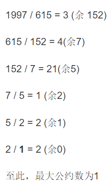

### 数学

#### 最大公约数最小公倍数

#### 1.素数分解

```java
class Solution {
    public int countPrimes(int n) {
        boolean[] isPrim=new boolean[n+1];
        Arrays.fill(isPrim,true);
        for(int i=2;i*i<n;i++){ //由于因子对称性，i只需要遍历到sqrt(n)。例如12，只需要遍历到3即可，会修改后面的4
            if(isPrim[i]){ //若一个数是素数，那么它的倍数一定不是素数
                for(int j=i*i;j<n;j+=i){ //比如 n = 25，i = 4 时算法会标记 4 × 2 = 8，4 × 3 = 12 等等数字，但是这两个数字已经被 i = 2 和 i = 3 的 2 × 4 和 3 × 4 标记了。所以j从i*i开始
                    isPrim[j]=false;
                }
            }
        }
        int count=0;
        for(int i=2;i<n;i++){
            if(isPrim[i]){
                count++;
            }
        }
        return count;
    }
}
```

#### 2.最大公约数



```java
int gcd(int a, int b) { //a是被除数，b是除数
    return b == 0 ? a : gcd(b, a % b); //这把的除数当下把被除数，这把余数当下把除数
}
```

最小公倍数为两数的乘积除以最大公约数。

```java
int lcm(int a, int b) {
    return a * b / gcd(a, b);
}
```

#### 3.使用位操作和减法求解最大公约数

.assets/image-20200726111903612.png)

```java
public int gcd(int a, int b) {
    if (a < b) {
        return gcd(b, a);
    }
    if (b == 0) {
        return a;
    }
    boolean isAEven = isEven(a), isBEven = isEven(b);
    if (isAEven && isBEven) {
        return 2 * gcd(a >> 1, b >> 1);
    } else if (isAEven && !isBEven) {
        return gcd(a >> 1, b);
    } else if (!isAEven && isBEven) {
        return gcd(a, b >> 1);
    } else {
        return gcd(b, a - b);
    }
}
```

#### 进制转换

#### 1.7进制

短除法

不断除以7，取余数。结果是余数逆序

```java
class Solution {
    public String convertToBase7(int num) {
        if(num==0) return "0";
        StringBuilder sb=new StringBuilder(); //操作频繁用stringbuilder，用+=可能会产生过多stringbuilder对象
        boolean isNegative=num<0;
        if(isNegative){
            num=-num;
        }
        while(num>0){
            sb.append(num%7); 
            num/=7; //比如最后是5,/=7以后num就变成0了
        }
        String res=sb.reverse().toString();
        return isNegative?"-"+res:res;
    }
}
```

```java
public String convertToBase7(int num) {
    return Integer.toString(num, 7);
}
```

#### 2.16进制

还是短除法，只是是计算机形式

```java
class Solution {
    public String toHex(int num) {
        char[] map="0123456789abcdef".toCharArray();
        if(num==0) return "0";
        StringBuilder sb=new StringBuilder();
        while(num!=0){
            sb.append(map[num&0b1111]);//num&0b1111得到低4位
            num>>>=4;// 因为考虑的是补码形式，因此符号位就不能有特殊的意义，需要使用无符号右移，左边填0。相当于除以16
        }
        return sb.reverse().toString();
    }
}
```

#### 3.Excel表列名称

相当于26进制。因为是从 1 开始计算的，而不是从 0 开始，因此需要对 n 执行 -1 操作。

```java
class Solution {
    public String convertToTitle(int n) {
        if(n==0) return "";
        n--;
        return convertToTitle(n/26)+(char)(n%26+'A');
    }
}
```

#### 阶乘

#### 1.统计阶乘尾部有多少个0

尾部的 0 由 2 * 5 得来，因此只需要统计阶乘的数中有多少2和5组成的因子对即可。2 的数量明显多于 5 的数量，对于一个5一定能找到对应的2，因此只要统计有多少个 5 即可。

对于一个数的阶乘，就如之前分析的，5 的因子一定是每隔 5 个数出现一次，也就是下边的样子。

n! = 1 * 2 * 3 * 4 * (1 * 5) * ... * (2 * 5) * ... * (3 * 5) *... * n

因为每隔 5 个数出现一个 5，所以计算出现了多少个 5，我们只需要用 n/5 就可以算出来。

... * (1 * 5) * ... * (1 * 5 * 5) * ... * (2 * 5 * 5) * ... * (3 * 5 * 5) * ... * n

每隔 25 个数字，出现的是两个 5，所以除了每隔 5 个数算作一个 5，每隔 25 个数，又多贡献一个5。

也就是我们需要再加上 n / 25 个 5。同理我们还会发现每隔 `5 * 5 * 5 = 125 `个数字，会出现 `3` 个 `5`，所以我们还需要再加上 `n / 125` 。

最终 `5` 的个数就是 `n / 5 + n / 25 + n / 125 ...`

写程序的话，如果直接按照上边的式子计算，分母可能会造成溢出。所以算 n / 25 的时候，我们先把 n 更新，n = n / 5，然后再计算 n / 5 即可。后边的同理。

这个想法其实来源于统计阶乘中每个数含有多少因子5，最终方法是统计的简化版，不用遍历每一个数(O(n))

```java
class Solution {
    public int trailingZeroes(int n) {
        int count=0;
        while(n!=0){
            count+=n/5;
            n/=5;
        }
        return count;
    }
}
```

在这种方法中，我们将 n除以5的每个幂。要计算$log_5n$次，所以时间复杂度O(logn)

#### 字符串加法减法

#### 1.二进制加法

模拟

```java
class Solution {
    public String addBinary(String a, String b) {
        int i=a.length()-1,j=b.length()-1,carry=0;
        StringBuilder sb=new StringBuilder();
        while(carry==1||i>=0||j>=0){ //carry==1是怕两个加完还有进位，比如两个三位的加出一个四位的
            if(i>=0&&a.charAt(i--)=='1'){ //carry是每一步的和，只有0，1，2三种值
                carry++;
            }
            if(j>=0&&b.charAt(j--)=='1'){
                carry++;
            }
            sb.append(carry%2); //模2就是当位要append的值
            carry/=2; //自己除以2得到下一位的进位值，当位的和是2，进位就是1，否则进位是0
        }
        return sb.reverse().toString();

    }
}
```

#### 2.字符串十进制加法

与二进制类似

```java
class Solution {
    public String addStrings(String num1, String num2) {
        int i=num1.length()-1,j=num2.length()-1,carry=0;
        StringBuilder sb=new StringBuilder();
        while(carry!=0||i>=0||j>=0){
            if(i>=0){
                carry+=num1.charAt(i)-'0';
                i--;
            }
            if(j>=0){
                carry+=num2.charAt(j)-'0';
                j--;
            }
            sb.append(carry%10);
            carry/=10;
        }
        return sb.reverse().toString();
    }
}
```

#### 相遇问题

#### 1.改变数组元素使所有的数组元素都相等

这是个典型的相遇问题，移动距离最小的方式是所有元素都移动到中位数。理由如下：

设 m 为中位数。a 和 b 是 m 两边的两个元素，且 b > a。要使 a 和 b 相等，它们总共移动的次数为 b - a，这个值等于 (b - m) + (m - a)，也就是把这两个数移动到中位数的移动次数。

设数组长度为 N，则可以找到 N/2 对 a 和 b 的组合，使它们都移动到 m 的位置。

**解法1**

先排序，时间复杂度：O(NlogN)，往中间夹逼

```java
class Solution {
    public int minMoves2(int[] nums) {
        Arrays.sort(nums);
        int l=0,h=nums.length-1,count=0;
        while(l<=h){
            count+=nums[h]-nums[l];
            l++;
            h--;
        }
        return count;
    }
}
```

**解法2**

先快速选择，不用排序，找到中位数，时间复杂度 O(N)

```java
class Solution {
    public int minMoves2(int[] nums) {
        int middle=findKthSmallest(nums,nums.length/2);
        int count=0;
        for(int num:nums){
            count+=Math.abs(middle-num);
        }
        return count;
    }
    private int findKthSmallest(int[] nums,int k){
        int l=0,h=nums.length-1;
        while(l<h){
            int j=partition(nums,l,h);
            if(j==k) break;
            else if(j<k){
                l=j+1;
            }
            else{
                h=j-1;
            }
        }
        return nums[k];
    }
    private int partition(int[] nums,int l,int h){
        int i=l,j=h+1;
        while(true){
            while(nums[++i]<nums[l]&&i<h);
            while(nums[--j]>nums[l]&&j>l);
            if(i>=j){
                break;
            }
            swap(nums,i,j);
        }
        swap(nums,j,l);
        return j;
    }
    private void swap(int[] nums,int i,int j){
        int temp=nums[i];
        nums[i]=nums[j];
        nums[j]=temp;
    }
}
```

#### 多数投票问题

#### 1.数组中出现次数多于n/2的元素

摩尔投票法

.assets/image-20200730160556754.png)

```java
class Solution {
    public int majorityElement(int[] nums) {
        int count=0,candidate=nums[0];
        for(int num:nums){
            if(count==0){ //票数为0，更换候选人
                candidate=num;
            }
            if(candidate==num){
                count++; 
            }
            else{
                count--;
            }
        }
        return candidate;
    }
}
```

#### 其他

#### 1.平方数

平方序列：1,4,9,16,..

间隔：3,5,7,...

间隔为等差数列，公差为2，使用这个特性可以得到从 1 开始的平方序列。比如4-1-3=0，16-1-3-5-7=0

```java
class Solution {
    public boolean isPerfectSquare(int num) {
        int temp=1;
        while(num>0){
            num-=temp;
            temp+=2;
        }
        return num==0;
    }
}
```

#### 2. 3的n次方

```java
class Solution {
    public boolean isPowerOfThree(int n) {
        if(n<1) return false;
        while(n%3==0){ //只要能被3整除
            n/=3; //不断除以3
        }
        return n==1;
    }
}
```

或者int型4个字节n最大2147483647，最大就3的19次方不超过这个

```java
public boolean isPowerOfThree(int n) {
    return n > 0 && (1162261467 % n == 0);
}
```

#### 3.乘积数组

剑指offer原题：构建乘积数组

```java
class Solution {
    public int[] productExceptSelf(int[] nums) {
        int n=nums.length;
        int[] B=new int[n];
        B[0]=1;
        for(int i=1;i<n;i++){
            B[i]=B[i-1]*nums[i-1];
        }
        int tmp=1;
        for(int i=n-2;i>=0;i--){
            tmp*=nums[i+1];
            B[i]*=tmp;
        }
        return B;
    }
}
```

#### 4.找出数组中乘积最大的3个数

可以排序。如果数组中所有元素都是非负数，答案即为最后三个元素乘积。如果有负数，那可能会是最小两个负数（绝对值大）和最大正数相乘。两者取最大。但实际上只要求出数组中最大的三个数以及最小的两个数，因此我们可以不用排序，用线性扫描直接得出这五个数。

```java
class Solution {
    public int maximumProduct(int[] nums) {
        int min1=Integer.MAX_VALUE,min2=Integer.MAX_VALUE; //min1<min2
        int max1=Integer.MIN_VALUE,max2=Integer.MIN_VALUE,max3=Integer.MIN_VALUE; //max3>max2>max1
        for(int num:nums){
            if(num<min1){  //小于min1全员降级
                min2=min1;
                min1=num;
            }
            else if(num<min2){
                min2=num;
            }
            if(num>max3){ //大于max3全员升级
                max1=max2;
                max2=max3;
                max3=num;
            }
            else if(num>max2){
                max1=max2;
                max2=num;
            }
            else if(num>max1){
                max1=num;
            }
        }
        return Math.max(min1*min2*max3,max1*max2*max3);
    }
}
```


