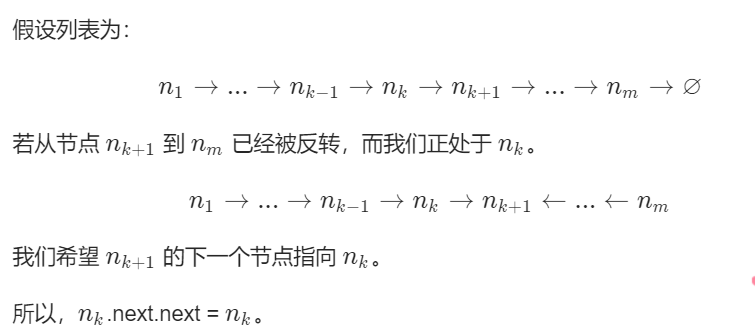
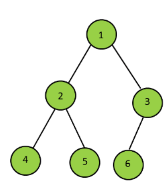

## 数据结构

### 链表

#### 1.找出两个链表的交点

剑指offer原题，只是这道题要求时间复杂度O(N)，空间复杂度O(1)。

A和B两个链表长度可能不同，但是A+B和B+A的长度是相同的，所以遍历A+B和遍历B+A一定是**同时结束**。 如果A,B相交的话A和B有一段尾巴是相同的，所以两个遍历的指针一定会**同时到达交点**。如果A,B不相交的话两个指针就会同时到达A+B（B+A）的尾节点。

```java
public class Solution {
    public ListNode getIntersectionNode(ListNode headA, ListNode headB) {
        ListNode p1=headA,p2=headB;
        while(p1!=p2){
            p1=p1==null?headB:p1.next; //链表A到底了指向链表B的头
            p2=p2==null?headA:p2.next; //链表B到底了指向链表A的头
        }
        return p1;
    }
}
```

时间复杂度O(M+N)，空间复杂度O(1)

如果只是判断是否存在交点，那么可以直接比较两个链表的最后一个节点是否相同。

#### 2.链表反转

剑指offer原题

**迭代**

```java
class Solution {
    public ListNode reverseList(ListNode head) {
        ListNode pre=null;
        ListNode cur=head;
        while(cur!=null){
            ListNode nextTemp=cur.next; //先保存下一个结点
            cur.next=pre; //更改当前节点的next，也就是改方向
            pre=cur; //pre和cur同时后移，当cur==null时，pre就是新的头节点
            cur=nextTemp;
        }
        return pre;
    }
}
```

O(N),O(1)

**递归**



```java
class Solution {
    public ListNode reverseList(ListNode head) {
        if(head==null||head.next==null) return head;//head==null返回null,head.next==null比如n_m要返回n_m
        ListNode p=reverseList(head.next); //p是已经反转好的链表的头，非空尾是head.next，n_k+1
        head.next.next=head; //n_k+1.next原先是null改为n_k
        head.next=null; //n_k.next改为null，这样n_m到n_k的链表就改好了
        return p;
    }
}
```

O(N),O(N)

#### 3.归并两个有序的链表

剑指offer原题，剑指的做法是迭代，空间复杂度比这里高一些

**迭代**

```java
class Solution {
    public ListNode mergeTwoLists(ListNode l1, ListNode l2) {
        ListNode preHead=new ListNode(-1); //方便返回结果
        ListNode resEnd=preHead; //当前结果链表的最后一个非空节点
        while(l1!=null&&l2!=null){
            if(l1.val<=l2.val){
                resEnd.next=l1;
                l1=l1.next; //谁小谁往后
            }
            else{
                resEnd.next=l2;
                l2=l2.next;
            }
            resEnd=resEnd.next; //resEnd后移
        }
        resEnd.next=l1==null?l2:l1; //合并剩下的
        return preHead.next;
    }
}
```

O(M+N),O(1)

**递归**

```java
class Solution {
    public ListNode mergeTwoLists(ListNode l1, ListNode l2) {
        if(l1==null){ //l1先空接l2
            return l2;
        }
        if(l2==null){
            return l1;
        }
        if(l1.val<=l2.val){
            l1.next=mergeTwoLists(l1.next,l2);//l1小，l1接(l1.next,l2)的结果
            return l1;
        }
        else{
            l2.next=mergeTwoLists(l1,l2.next);
            return l2;
        }
    }
}
```

O(M+N),O(M+N)(空间复杂度是递归深度)

#### 4.删除有序链表中的重复元素

剑指原题，比剑指解法容易理解

**迭代**

```java
class Solution {
    public ListNode deleteDuplicates(ListNode head) {
        ListNode cur=head;
        while(cur!=null&&cur.next!=null){
            if(cur.val==cur.next.val){
                cur.next=cur.next.next;
            }
            else{
                cur=cur.next;
            }
        }
        return head;
    }
}
```

O(N),O(1)

**递归**

```java
class Solution {
    public ListNode deleteDuplicates(ListNode head) {
        if(head==null||head.next==null) return head; //当前空或者只有一个节点，也是底层
        head.next=deleteDuplicates(head.next); //当前要接后面的去重链表
        return head.val==head.next.val?head.next:head; //当前和下一个重复要取下一个
    }
}
```

#### 5.删除链表的倒数第n个节点

固然可以两次遍历列表，第一次找到要删除的然后第二次删了。可以优化为只遍历一次列表。fast先走n步，那fast走到底的时候，slow.next就是要删除的。比如1,2,3,4,5，删倒数第二的4，fast先走两步到3，fast到5的时候，slow正好到3。

```java
class Solution {
    public ListNode removeNthFromEnd(ListNode head, int n) {
        ListNode fast=head,slow=head;
        while(n-->0){
            fast=fast.next;
        }
        if(fast==null) return head.next; //这里题目保证n有效，所以最多就是n=链表长度，删除头节点
        while(fast.next!=null){
            fast=fast.next;
            slow=slow.next;
        }
        slow.next=slow.next.next;
        return head;
    }
}
```

O(N),O(1)

#### 6.交换链表中的相邻节点

交换涉及4个结点：pre-->l1-->l2-->next

```java
class Solution {
    public ListNode swapPairs(ListNode head) {
        ListNode node=new ListNode(-1); //要用node保存要返回的位置node.next，因为head会被交换到后面,pre会用来迭代
        node.next=head;
        ListNode pre=node;
        while(pre.next!=null&&pre.next.next!=null){
            ListNode l1=pre.next,l2=pre.next.next;
            ListNode next=l2.next;
            pre.next=l2; //这里顺序都无所谓了因为你节点都取出来了
            l2.next=l1;
            l1.next=next;
            pre=l1; //直接跳到交换后的l1作为新的pre
        }
        return node.next;
    }
}
```

O(N),O(1)

#### 7.链表求和

```java
class Solution {
    public ListNode addTwoNumbers(ListNode l1, ListNode l2) {
        ArrayDeque<Integer> s1=buildStack(l1); //先将链表数字存入栈中，栈和队列优先用ArrayDeque
        ArrayDeque<Integer> s2=buildStack(l2); 
        ListNode head=new ListNode(-1);
        int carry=0; //进位
        while(!s1.isEmpty()||!s2.isEmpty()||carry!=0){
            int x=s1.isEmpty()?0:s1.pop();
            int y=s2.isEmpty()?0:s2.pop();
            int sum=carry+x+y; //这里求和和前面做过的加法器类似
            ListNode node=new ListNode(sum%10);
            node.next=head.next; //因为是不断进位往前所以这里采用头插法
            head.next=node;
            carry=sum/10;
        }
        return head.next;
    }
    private ArrayDeque<Integer> buildStack(ListNode l){
        ArrayDeque<Integer> s=new ArrayDeque<>();
        while(l!=null){
            s.push(l.val);
            l=l.next;
        }
        return s;
    }
}
```

#### 8.回文链表

找到前半部分链表的尾节点。可以使用快慢指针在一次遍历中找到：慢指针一次走一步，快指针一次走两步，快慢指针同时出发。当快指针移动到链表的末尾时，慢指针到链表的中间。通过慢指针将链表分为两部分。
反转后半部分链表。
判断是否为回文。
恢复链表。
返回结果。

```java
class Solution {
    public boolean isPalindrome(ListNode head) {
        if(head==null) return true;
        ListNode FirstHalfEnd=EndOfFistHalf(head);
        ListNode SecondHalfStart=reverseList(FirstHalfEnd.next);
        ListNode p1=head,p2=SecondHalfStart;
        while(p2!=null){ //后半部分长度<=前半部分长度，所以以后半部为准
            if(p1.val!=p2.val) return false;
            p1=p1.next;
            p2=p2.next;
        }
        reverseList(SecondHalfStart); //再反转一次，恢复链表
        return true;
    }
    private ListNode EndOfFistHalf(ListNode head){//找到前半部分尾结点。奇数：1,2,3,4,5,slow=3,fast=5。偶数：1,2,2,1,slow=2,fast=2。注意看下面的条件判断。
        ListNode slow=head,fast=head;
        while(fast.next!=null&&fast.next.next!=null){
            slow=slow.next;
            fast=fast.next.next;
        }
        return slow;
    }
    private ListNode reverseList(ListNode head){ //反转链表原先做过的
        ListNode pre=null;
        ListNode cur=head;
        while(cur!=null){
            ListNode nextTemp=cur.next;
            cur.next=pre;
            pre=cur;
            cur=nextTemp;
        }
        return pre;
    }
}
```

O(N),O(1)

#### 9.分隔链表

```java
class Solution {
    public ListNode[] splitListToParts(ListNode root, int k) {
        int N=0;
        ListNode cur=root;
        while(cur!=null){ //计算链表长度
            N++;
            cur=cur.next;
        }
        int size=N/k,remain=N%k; //size是基础长度,可能会加1，取决于余数。比如若k=3,11分割成3+1,3+1,3。余数是2
        cur=root;
        ListNode[] res=new ListNode[k];
        for(int i=0;i<k&&cur!=null;i++){
            res[i]=cur;
            for(int j=0;j<size+(i<remain?1:0)-1;j++){
                cur=cur.next; //长度为4要next3次
            }
            ListNode next=cur.next; //保存一下个头，因为cur.next要指空了
            cur.next=null;
            cur=next;
        }
        return res;
    }
}
```

#### 10.链表元素按奇偶聚集

我们用变量 head 和 odd 保存奇链表的头和尾指针。 evenHead 和 even 保存偶链表的头和尾指针。算法会遍历原链表一次并把奇节点放到奇链表里去、偶节点放到偶链表里去。遍历整个链表我们至少需要一个指针作为迭代器。这里 odd 指针和 even 指针不仅仅是尾指针，也可以扮演原链表迭代器的角色。

.assets/image-20200811170420818.png)

.assets/image-20200811170434213.png)

```java
class Solution {
    public ListNode oddEvenList(ListNode head) {
        if(head==null) return head;
        ListNode odd=head,even=head.next,evenhead=even;
        while(even!=null&&even.next!=null){ //不知道原链表长度是奇数还是偶数，even肯定比odd靠后
            odd.next=odd.next.next;
            odd=odd.next; //奇往后移动
            even.next=even.next.next;
            even=even.next;
        }
        odd.next=evenhead;
        return head;
    }
}
```

O(N),O(1)


### 树

#### 1.树的高度（树的最大深度）

剑指原题

```java
class Solution {
    public int maxDepth(TreeNode root) {
        if(root==null) return 0;
        return Math.max(maxDepth(root.left),maxDepth(root.right))+1;
    }
}
```

#### 2.平衡树

剑指原题

```java
class Solution {
    public boolean isBalanced(TreeNode root) {
        if(root==null) return true;
        return maxDepth(root)!=-1;
    }
    private int maxDepth(TreeNode root){
        if(root==null) return 0;
        int left=maxDepth(root.left);
        if(left==-1) return -1;
        int right=maxDepth(root.right);
        if(right==-1) return -1;
        if(Math.abs(left-right)<=1) return Math.max(left,right)+1;
        return -1;
    }
}
```

#### 3.两节点的最长路径

任意一条路径均可以被看作由某个节点为起点，从其左儿子和右儿子向下遍历的路径拼接得到。长度正好是left+right。

```java
class Solution {
    int res;
    public int diameterOfBinaryTree(TreeNode root) {
        maxDepth(root);
        return res;
    }
    private int maxDepth(TreeNode root){
        if(root==null) return 0;
        int left=maxDepth(root.left);
        int right=maxDepth(root.right);
        res=Math.max(res,left+right); //求maxDepth的时候刷新一下就行
        return Math.max(left,right)+1;
    }
}
```

#### 4.翻转二叉树（镜像）

剑指原题

```java
class Solution {
    public TreeNode invertTree(TreeNode root) {
        if(root==null) return null;
        TreeNode left=invertTree(root.left);
        TreeNode right=invertTree(root.right);
        root.left=right;
        root.right=left;
        return root;
    }
}
```

#### 5.合并二叉树

```java
class Solution {
    public TreeNode mergeTrees(TreeNode t1, TreeNode t2) {
        if(t1==null&&t2==null) return null;
        if(t1==null) return t2;
        if(t2==null) return t1;
        TreeNode root=new TreeNode(t1.val+t2.val);
        root.left=mergeTrees(t1.left,t2.left);
        root.right=mergeTrees(t1.right,t2.right);
        return root;
    }
}
```

#### 6.判断路径和是否等于一个数

类似剑指offer

```java
class Solution {
    public boolean hasPathSum(TreeNode root, int sum) {
        if(root==null) return false;
        if(root.left==null&&root.right==null&&sum==root.val) return true; //叶子
        return hasPathSum(root.left,sum-root.val)||hasPathSum(root.right,sum-root.val);
    }
}
```

#### 7.统计路径和等于一个数的路径数量

这里路径和上一题不一样。这里路径不一定以 root 开头，也不一定以 leaf 结尾。

```java
class Solution {
    public int pathSum(TreeNode root, int sum) {
        if(root==null) return 0;
        int res=pathSumStartWithCur(root,sum)+pathSum(root.left,sum)+pathSum(root.right,sum); 
        return res;
    }
    private int pathSumStartWithCur(TreeNode root,int sum){ //以当前节点开头，某一节点（不一定叶子）结尾，和为sum的路径数
        if(root==null) return 0;
        int res=0;
        if(root.val==sum) res++;
        res+=pathSumStartWithCur(root.left,sum-root.val)+pathSumStartWithCur(root.right,sum-root.val);
        return res;
    }
}
```

下面这个更好理解：

①先序递归遍历每个节点
②以每个节点作为起始节点DFS寻找满足条件的路径

DFS类似于树的先序遍历，BFS类似于树根为起点的层序遍历。

```java
class Solution {
    int res=0;
    public int pathSum(TreeNode root, int sum) {
        if(root==null) return 0;
        dfs(root,sum);   //遍历每一个节点，对每个节点的操作是以当前节点为出发点，是否有和为sum的路径。
        pathSum(root.left,sum);
        pathSum(root.right,sum);
        return res;
    }
    private void dfs(TreeNode root,int sum){ 
        if(root==null) return;
        if(root.val==sum) res++;
        dfs(root.left,sum-root.val); //节点值有正有负，所以要往下搜到叶子。比如正负相消，往下搜又多一条。
        dfs(root.right,sum-root.val);
    }
}
```

#### 8.子树

类似剑指原题，但是这里是子树和子结构不同，子树是相同起点必须完全一样。写的结构与上题类似，递归嵌套。遍历s的节点，对每个节点的操作是以当前节点为出发点，t是否是s的子树

```java
class Solution {
    public boolean isSubtree(TreeNode s, TreeNode t) {
        if(s==null) return false;
        return isSubtreeSameStart(s,t)||isSubtree(s.left,t)||isSubtree(s.right,t);//类似前序遍历的结构isSubtreeSameStart是对s每个节点的操作，isSubtree是遍历
    }
    private boolean isSubtreeSameStart(TreeNode s,TreeNode t){
        if(s==null&&t==null) return true; //两者必须一模一样
        if(s==null||t==null) return false;
        if(s.val!=t.val) return false;
        return isSubtreeSameStart(s.left,t.left)&&isSubtreeSameStart(s.right,t.right);
    }
}
```

#### 9.对称二叉树

剑指原题，第二个函数思想几乎和上题一致，判断两个树是否完全相等，只有轻微改动。

```java
class Solution {
    public boolean isSymmetric(TreeNode root) {
        if(root==null) return true;
        return isSame(root.left,root.right);
    }
    private boolean isSame(TreeNode s,TreeNode t){
        if(s==null&&t==null) return true;
        if(s==null||t==null) return false;
        if(s.val!=t.val) return false;
        return isSame(s.left,t.right)&&isSame(s.right,t.left);
    }
}
```

#### 10.二叉树的最小深度

与最大深度类似，但是注意左右其中一个空的时候，不是叶子结点，不能返回0+1，要返回正常深度。因为深度是要根到叶子才算。求最大深度的时候max自动取最大的所以不影响。

```java
class Solution {
    public int minDepth(TreeNode root) {
        if(root==null) return 0;
        int left=minDepth(root.left);
        int right=minDepth(root.right);
        if(left==0||right==0) return left+right+1;
        return Math.min(left,right)+1;
    }
}
```

#### 11.统计左叶子结点的和

前序遍历每个节点，判断每个节点的左孩子是不是叶子

```java
class Solution {
    int res=0;
    public int sumOfLeftLeaves(TreeNode root) {
        if(root==null) return 0;
        if(root.left!=null&&root.left.left==null&&root.left.right==null) res+=root.left.val;
        sumOfLeftLeaves(root.left);
        sumOfLeftLeaves(root.right);
        return res;
    }
}
```

#### 12.最长同值路径

与第3题：两节点最长路径，差不多。只是第三题不用判断当前root跟左右是不是相等，无脑接当前root。这题比如如果跟左边相等，右边不等就只接左边，右边是0。两边都等路径长度就加了2。

```java
class Solution {
    int res=0;
    public int longestUnivaluePath(TreeNode root) {
        if(root==null) return 0;
        maxDepth(root);
        return res;
    }
    private int maxDepth(TreeNode root){
        if(root==null) return 0;
        int left=maxDepth(root.left);
        int right=maxDepth(root.right);
        int leftpath=root.left!=null&&root.left.val==root.val?left+1:0;
        int rightpath=root.right!=null&&root.right.val==root.val?right+1:0;
        res=Math.max(res,leftpath+rightpath);
        return Math.max(leftpath,rightpath); //返回当前同值最大深度，不能写max(left,right)+1有可能有一边虽然大但是被舍弃了

    }
}
```

#### 13.间隔遍历（打家劫舍|||）

```java
class Solution {
    public int rob(TreeNode root) {
        int[] res=PostOrder(root);
        return Math.max(res[0],res[1]);
    }
    private int[] PostOrder(TreeNode root){
        if(root==null){
            return new int[]{0,0};
        }
        int[] left=PostOrder(root.left); //后序遍历，因为先要左右的结果，然后才能计算当前状态
        int[] right=PostOrder(root.right);
        int[] dp=new int[2];
        // dp[0]：以当前节点为根结点的子树能够偷取的最大价值，规定当前节点结点不偷
        // dp[1]：以当前节点为根结点的子树能够偷取的最大价值，规定当前节点结点偷
        dp[0]=Math.max(left[0],left[1])+Math.max(right[0],right[1]); //当前不偷，左右可偷可不偷
        dp[1]=root.val+left[0]+right[0]; //当前偷，左右不偷
        return dp;
    }
}
```

#### 14.找出二叉树中第二小的节点

```java
class Solution {
    public int findSecondMinimumValue(TreeNode root) {
        if(root==null) return -1;
        return find(root,root.val);
    }
    private int find(TreeNode root,int val){ //find返回以root为根的子树，不等于val的最小值
        if(root.val!=val) return root.val; //由于题目规定特性，越上面的越小

        //下面是root.val==val的情况
        if(root.left==null) return -1; //递归底层，到叶子还是root.val==val的话说明找不到
        int left=find(root.left,val); 
        int right=find(root.right,val);
        if(left==-1) return right;//左边找不到
        if(right==-1) return left;
        return Math.min(left,right); //两边都找到，结果是两者取小，注意此时是root.val==val的
    }
}
```

#### 

#### 层次遍历

#### 1.一棵树每层节点的平均数

```java
class Solution {
    public List<Double> averageOfLevels(TreeNode root) {
        List<Double> res=new ArrayList<>();
        if(root==null) return res;
        Deque<TreeNode> q=new ArrayDeque<>();
        q.addLast(root);
        while(!q.isEmpty()){
            double sum=0;
            int size=q.size(); //这里每层大小先取出来，不然后面会add新的
            for(int i=0;i<size;i++){
                TreeNode t=q.pollFirst();
                sum+=t.val;
                if(t.left!=null) q.addLast(t.left);
                if(t.right!=null) q.addLast(t.right);
            }
            res.add(sum/size);
        }
        return res;
    }
}
```

```java
        //将指定元素插入双向队列开头
        void addFirst (Object e );
        // 将指定元素插入双向队列末尾
        void addLast (Object e );
        // 返回对应的迭代器，以逆向顺序来迭代队列中的元素
        Iterator descendingIterator ();
        // 获取但不删除双向队列的第一个元素
        Object getFirst ();
        // 获取但不删除双向队列的最后一个元素 
        Object getLast ();
        // 将指定元素插入双向队列开头 
        boolean offerFirst (Object e );
        // 将指定元素插入双向队列结尾 
        boolean offerLast (Object e );
        // 获取但不删除双向队列的第一个元素，如果双端队列为空则返回 null 
        Object peekFirst ();
        // 获取但不删除双向队列的最后一个元素，如果此双端队列为空则返回 null 
        Object peekLast ();
        // 获取并删除双向队列的第一个元素，如果此双端队列为空则返回 null
        Object pollFirst ();
        // 获取并删除双向队列的最后一个元素，如果此双端队列为空则返 null 
        Object pollLast ();
        // 退栈出该双向队列中的第一个元素 
        Object pop ();
        // 将元素入栈进双向队列栈中
        void push (Object e );
        // 获取并删除该双向队列的第一个元素 
        Object removeFirst ();
        // 删除双向队列第一次出现的元素 e 
        Object removeFirstOccurrence (Object e );
        // 获取并删除双向队列的最后一个元素 
        removeLast();
        // 删除双向队列最后一次出现的元素 e 
        removeLastOccurrence(Object e);
```

#### 2.得到左下角的节点

小改层次遍历：每层从右往左，最后剩下的一定是左下角

```java
class Solution {
    public int findBottomLeftValue(TreeNode root) {
        ArrayDeque<TreeNode> q=new ArrayDeque<>();
        q.addLast(root);
        while(!q.isEmpty()){
            root=q.pollFirst();
            if(root.right!=null) q.addLast(root.right);
            if(root.left!=null) q.addLast(root.left);
        }
        return root.val;
    }
}
```


#### 前中后序遍历

#### 1.非递归实现二叉树的前序遍历

用栈来做

```java
class Solution {
    public List<Integer> preorderTraversal(TreeNode root) {
        List<Integer> res=new ArrayList<>();
        if(root==null) return res;
        Deque<TreeNode> stack=new ArrayDeque<>();
        stack.addLast(root);
        while(!stack.isEmpty()){
            TreeNode node=stack.pollLast();
            res.add(node.val);
            if(node.right!=null) stack.addLast(node.right); //先右后左，保证左子树先遍历
            if(node.left!=null) stack.addLast(node.left);
        }
        return res;
    }
}
```

#### 2.非递归实现二叉树的后序遍历

前序遍历为 root -> left -> right，后序遍历为 left -> right -> root。可以修改前序遍历成为 root -> right -> left，那么这个顺序就和后序遍历正好相反。翻转可以直接用LinkedList的addFirst头插，或者Collections.reverse(res);

```java
class Solution {
    public List<Integer> postorderTraversal(TreeNode root) {
        LinkedList<Integer> res=new LinkedList<>();
        if(root==null) return res;
        ArrayDeque<TreeNode> stack=new ArrayDeque<>();
        stack.addLast(root);
        while(!stack.isEmpty()){
            TreeNode node=stack.pollLast();
            res.addFirst(node.val);
            if(node.left!=null) stack.addLast(node.left);
            if(node.right!=null) stack.addLast(node.right);
        }
        return res;
    }
}
```

#### 3.非递归实现二叉树的中序遍历



```java
class Solution {
    public List<Integer> inorderTraversal(TreeNode root) {
        List<Integer> res=new ArrayList<>();
        if(root==null) return res;
        ArrayDeque<TreeNode> stack=new ArrayDeque<>();
        TreeNode cur=root;
        while(cur!=null||!stack.isEmpty()){
            while(cur!=null){
                stack.addLast(cur);
                cur=cur.left;
            } //比如第一轮直接指到最左叶子
            TreeNode node=stack.pollLast();
            res.add(node.val);
            cur=node.right;   //第一轮空，然后第二轮就先弹出2
        }
        return res;
    }
}
```

#### 

#### BST

#### 1.修剪二叉查找树

题目要求返回BST被修剪后的根结点，那么我们从根结点开始修剪。
如果根结点太小，根结点的左子树的所有结点只会更小，说明根结点及其左子树都应该剪掉，因此直接返回右子树的修剪结果。
如果根结点太大，根结点的右子树的所有结点只会更大，说明根结点及其右子树都应该剪掉，因此直接返回左子树的修剪结果。
如果根结点没问题，则递归地修剪左子结点和右子结点。
如果结点为空，说明无需修剪，直接返回空即可。
左右子结点都修剪完后，返回自身。

```java
class Solution {
    public TreeNode trimBST(TreeNode root, int L, int R) {
        if(root==null) return null;
        if(root.val>R) return trimBST(root.left,L,R);
        if(root.val<L) return trimBST(root.right,L,R);
        root.left=trimBST(root.left,L,R);
        root.right=trimBST(root.right,L,R);
        return root;
    }
}
```

#### 2.寻找二叉查找树的第k个元素

二叉搜索树中序遍历就是升序

```java
class Solution {
    int count=0;
    int res;
    public int kthSmallest(TreeNode root, int k) {
        InOrder(root,k);
        return res;
    }
    private void InOrder(TreeNode root,int k){
        if(root==null) return;
        InOrder(root.left,k);
        count++;
        if(count==k){
            res=root.val;
            return;
        }
        InOrder(root.right,k);
    }
}
```

#### 3.把二叉查找树每个节点的值都加上比它大的节点的值

```java
class Solution {
    int sum=0;
    public TreeNode convertBST(TreeNode root) {
        traversal(root);
        return root;
    }
    private void traversal(TreeNode root){
        if(root==null) return;
        traversal(root.right); //改下遍历顺序，先遍历右子树即可，右边一定都比当前大
        sum+=root.val;
        root.val=sum;
        traversal(root.left);
    }
}
```

#### 4.二叉搜索树的最近公共祖先

当前比p,q都大，最近公共祖先一定在左子树。都小，一定在右子树

```java
class Solution {
    public TreeNode lowestCommonAncestor(TreeNode root, TreeNode p, TreeNode q) {
        if(root.val>p.val&&root.val>q.val) return lowestCommonAncestor(root.left,p,q);
        if(root.val<p.val&&root.val<q.val) return lowestCommonAncestor(root.right,p,q);
        return root;
    }
}
```

#### 5.二叉树的最近公共祖先

```java
class Solution {
    public TreeNode lowestCommonAncestor(TreeNode root, TreeNode p, TreeNode q) {
        if(root==null||root==p||root==q) return root; //p,q最先遇到的肯定是祖先，遇到就返回
        TreeNode left=lowestCommonAncestor(root.left,p,q);
        TreeNode right=lowestCommonAncestor(root.right,p,q);
        if(left==null) return right; //左边空，说明p,q都在右边，且right一定是其中一个，因为遇到他们就返回
        if(right==null) return left;
        return root; //两边都不空，说明p,q在两边，当前root就是最近公共祖先。left和right会指向p,q（顺序不一定），因为遇到p,q就返回
    }
}
```

#### 6.从有序数组中构造二叉查找树

```java
class Solution {
    public TreeNode sortedArrayToBST(int[] nums) {
        return ToBST(nums,0,nums.length-1);
    }
    private TreeNode ToBST(int[] nums,int start,int end){
        if(start>end) return null;
        int mid=(start+end)/2;
        TreeNode root=new TreeNode(nums[mid]);
        root.left=ToBST(nums,start,mid-1);
        root.right=ToBST(nums,mid+1,end);
        return root;
    }
}
```

#### 7.有序链表构造二叉查找树

```java
class Solution {
    public TreeNode sortedListToBST(ListNode head) {
        if(head==null) return null;
        if(head.next==null) return new TreeNode(head.val);
        ListNode premid=PreMid(head);
        ListNode mid=premid.next;
        premid.next=null; //mid与之前断开
        TreeNode root=new TreeNode(mid.val);
        root.left=sortedListToBST(head);
        root.right=sortedListToBST(mid.next);
        return root;
    }
    private ListNode PreMid(ListNode head){ //返回mid之前，比如1,2,3,4,5返回2位置，1,2，3,4,5,6也是返回2位置
        ListNode slow=head,fast=head.next;
        while(fast.next!=null&&fast.next.next!=null){
            slow=slow.next;
            fast=fast.next.next;
        }
        return slow;
    }
}
```

#### 8.二叉搜索树中找两个节点，使它们和为一个给定值

使用中序遍历得到有序数组之后，再利用双指针对数组进行查找。

应该注意到，这一题不能用分别在左右子树两部分来处理这种思想，因为两个待求的节点可能分别在左右子树中。

```java
class Solution {
    public boolean findTarget(TreeNode root, int k) {
        List<Integer> nums=new ArrayList<>();
        InOrder(root,nums);
        int i=0,j=nums.size()-1;
        while(i<j){
            int sum=nums.get(i)+nums.get(j);
            if(sum==k) return true;
            else if(sum<k) i++;
            else j--;
        }
        return false;
    }
    private void InOrder(TreeNode root,List<Integer> nums){
        if(root==null) return;
        InOrder(root.left,nums);
        nums.add(root.val);
        InOrder(root.right,nums);
    }
}
```

#### 9.寻找二叉查找树中众数（可能不止一个）

还是利用二叉查找树中序遍历有序这一特性，就不用额外开空间去统计数量，只需记录preNode值即可

```java
class Solution {
    int CurCount=1;
    int MaxCount=1;
    TreeNode preNode=null;
    public int[] findMode(TreeNode root) {
        List<Integer> restemp=new ArrayList<>();
        InOrder(root,restemp);
        int[] res=new int[restemp.size()];
        int i=0;
        for(int num:restemp){
            res[i++]=num;
        }
        return res;
    }
    private void InOrder(TreeNode root,List<Integer> restemp){
        if(root==null) return;
        InOrder(root.left,restemp); //preNode一定<=root
        if(preNode!=null){
            if(preNode.val==root.val) CurCount++; //先计算CurCount
            else CurCount=1;
        }
        if(CurCount>MaxCount){ //大于MaxCount原先的都不叫众数，先清空原先
            MaxCount=CurCount;
            restemp.clear();
            restemp.add(root.val);
        }
        else if(CurCount==MaxCount){ //等于就先加入结果
            restemp.add(root.val);
        }
        preNode=root;
        InOrder(root.right,restemp);
    }
}
```

几乎算是常数空间吧


#### Trie(前缀树，字典树)

#### 1.实现一个Trie

https://leetcode-cn.com/problems/implement-trie-prefix-tree/solution/shi-xian-trie-qian-zhui-shu-by-leetcode/

字符的值不直接保存在TrieNode中，用数组位置来保存这个信息。相当于树的根没有字母。

```java
class TrieNode {

    // R links to node children
    private TrieNode[] links;

    private final int R = 26; //26个英文字母

    private boolean isEnd;

    public TrieNode() {
        links = new TrieNode[R]; //构造的时候再分匹配空间
    }

    public boolean containsKey(char ch) { 
        return links[ch -'a'] != null;
    }
    public TrieNode get(char ch) {
        return links[ch -'a'];
    }
    public void put(char ch, TrieNode node) {
        links[ch -'a'] = node;
    }
    public void setEnd() {
        isEnd = true;
    }
    public boolean isEnd() {
        return isEnd;
    }
}

class Trie {
    private TrieNode root;

    public Trie() {
        root = new TrieNode();
    }

    // Inserts a word into the trie.
    public void insert(String word) {
        TrieNode node = root;
        for (int i = 0; i < word.length(); i++) {
            char currentChar = word.charAt(i);
            if (!node.containsKey(currentChar)) {
                node.put(currentChar, new TrieNode());
            }
            node = node.get(currentChar);
        }
        node.setEnd();
    }
        // search a prefix or whole key in trie and
    // returns the node where search ends
    private TrieNode searchPrefix(String word) { //自己用private,给别人用public
        TrieNode node = root;
        for (int i = 0; i < word.length(); i++) {
           char curLetter = word.charAt(i);
           if (node.containsKey(curLetter)) {
               node = node.get(curLetter);
           } else {
               return null;
           }
        }
        return node;
    }

    // Returns if the word is in the trie. 搜索键就必须最后一个节点是end
    public boolean search(String word) {
       TrieNode node = searchPrefix(word);
       return node != null && node.isEnd();
    }

    // Returns if there is any word in the trie
    // that starts with the given prefix. 搜索前缀就最后一个节点不空就行
    public boolean startsWith(String prefix) { 
        TrieNode node = searchPrefix(prefix);
        return node != null;
    }
}
```

.assets/image-20200819112126136.png)

.assets/image-20200819112326174.png)

我觉得这是为什么不用哈希表的原因，哈希如果有很多相同前缀的词汇太占空间

#### 2.实现一个Trie，用来求前缀和

java字典树的映射用法

用HashMap储存下一层连接的，相当于上面的links。

```java
class MapSum {
    private class Node{
        public int val;
        public HashMap<Character,Node> next;
        public Node(int val){
            val=val;
            next=new HashMap<>();
        }
        public Node(){
            this(0);
        }
    }
    private Node root;
    
    /** Initialize your data structure here. */
    public MapSum() {
        root=new Node();
    }
    
    public void insert(String key, int val) {
        Node cur=root;
        for(int i=0;i<key.length();i++){
            char c=key.charAt(i);
            if(cur.next.get(c)==null){
                cur.next.put(c,new Node());
            }
            cur=cur.next.get(c);
        }
        cur.val=val; //end节点要给值
    }
    
    public int sum(String prefix) {
        Node cur=root;
        for(int i=0;i<prefix.length();i++){
            char c=prefix.charAt(i);
            if(cur.next.get(c)==null){
                return 0;
            }
            cur=cur.next.get(c); //类似于原先的searchprefix先把前缀指到头
        }
        return sum(cur); //以前缀为根往下搜
    }
    private int sum(Node node){
        int res=node.val;
        for(Map.Entry<Character,Node> entry:node.next.entrySet()){
            res+=sum(entry.getValue()); //这里没管是不是end，不是加0就完了不影响
        }
        return res;
    }
}
```

