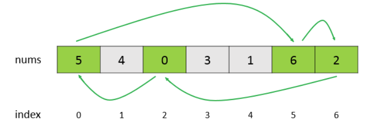

### 栈和队列

#### 1.两个栈实现一个队列

剑指原题

```java
class MyQueue {
    private ArrayDeque<Integer> in;
    private ArrayDeque<Integer> out;
    /** Initialize your data structure here. */
    public MyQueue() {
        in=new ArrayDeque<>();
        out=new ArrayDeque<>();
    }
    
    /** Push element x to the back of queue. */
    public void push(int x) {
        in.addLast(x);
    }
    private void in2out(){
        if(out.isEmpty()){
           while(!in.isEmpty()){
                out.addLast(in.pollLast());
            } 
        }
    }
    /** Removes the element from in front of queue and returns that element. */
    public int pop() {
        in2out();
        return out.pollLast();
    }
    
    /** Get the front element. */
    public int peek() {
        in2out();
        return out.getLast();
    }
    
    /** Returns whether the queue is empty. */
    public boolean empty() {
        return in.isEmpty()&&out.isEmpty();
    }
}

```

#### 2.用一个队列实现栈

push完x之后，把除了x之外的元素先出队再入队。这样就能保证顺序：x是最后入的，最先出。

```java
class MyStack {
    private ArrayDeque<Integer> q;
    /** Initialize your data structure here. */
    public MyStack() {
        q=new ArrayDeque<>();
    }
    
    /** Push element x onto stack. */
    public void push(int x) {
        q.addLast(x);
        int count=q.size();
        while(count-->1){
            q.addLast(q.pollFirst());
        }
    }
    
    /** Removes the element on top of the stack and returns that element. */
    public int pop() {
        return q.pollFirst();
    }
    
    /** Get the top element. */
    public int top() {
        return q.getFirst();
    }
    
    /** Returns whether the stack is empty. */
    public boolean empty() {
        return q.isEmpty();
    }
}

```

#### 3.最小值栈

剑指原题，只不过做法稍有不同

主栈和辅助栈同步压弹，主栈每个元素对应一个最小值。minstack每次压入的是min_stack顶和x取小，就保证min_stack顶是最小

.assets/image-20200820100900908.png)

```java
class MinStack {
    private ArrayDeque<Integer> stack;
    private ArrayDeque<Integer> minstack;
    //private int min;
    /** initialize your data structure here. */
    public MinStack() {
        stack=new ArrayDeque<>();
        minstack=new ArrayDeque<>();
        //min=Integer.MAX_VALUE;
        minstack.addLast(Integer.MAX_VALUE);
    }
    
    public void push(int x) {
        stack.addLast(x);
        minstack.addLast(Math.min(minstack.getLast(),x));
    }
    
    public void pop() {
        minstack.pollLast();
        stack.pollLast();
    }
    
    public int top() {
        return stack.getLast();
    }
    
    public int getMin() {
        return minstack.getLast();
    }
}
```

#### 4.用栈实现括号匹配

做这种匹配的题尽量不用if-else而用Map因为情况多了不好搞

```java
class Solution {
    public boolean isValid(String s) {
        int n=s.length();
        if(n%2==1) return false;
        Map<Character,Character> map=new HashMap<>(){ //匿名内部类+实例化代码块，可以方便地访问外部类的私有变量。这个内部类的父类是HashMap
            {
                put(')','(');
                put(']','[');
                put('}','{');
            }
        };
        Deque<Character> stack=new ArrayDeque<>(); //专门存放左括号
        for(int i=0;i<n;i++){
            char c=s.charAt(i);
            if(map.containsKey(c)){ //如果来右括号
                if(stack.isEmpty()||stack.pollLast()!=map.get(c)) return false; //看栈顶左括号是否与之匹配
            }else{
                stack.addLast(c); //如果来左括号，入栈
            }
        }
        return stack.isEmpty(); //匹配完栈应该是空的
    }
}
```

#### 5.每日温度（数组中元素与下一个比它大的元素之间的距离）

https://leetcode-cn.com/problems/daily-temperatures/solution/mei-ri-wen-du-by-leetcode-solution/

```java
class Solution {
    public int[] dailyTemperatures(int[] T) {
        int n=T.length;
        int[] res=new int[n];
        Deque<Integer> stack=new ArrayDeque<>(); //单调栈，储存下标
        for(int i=0;i<n;i++){
            while(!stack.isEmpty()&&T[i]>T[stack.getLast()]){
                int index=stack.removeLast(); //出栈就会得到那一天的结果，而在栈里就表示还没遇到第一个比它大的，一旦遇到就出
                res[index]=i-index;
            }
            stack.addLast(i);
        }
        return res;
    }
}
```

#### 6. 循环数组中比当前元素大的下一个元素

与上题类似，只是循环数组i要遍历到2*n才能找到其前面的数，真实下标就是i%n

```java
class Solution {
    public int[] nextGreaterElements(int[] nums) {
        int n=nums.length;
        int[] res=new int[n];
        Arrays.fill(res,-1); 
        Deque<Integer> stack=new ArrayDeque<>(); //单调栈，里面存储真实下标
        for(int i=0;i<2*n;i++){
            while(!stack.isEmpty()&&nums[i%n]>nums[stack.getLast()]){
                int index=stack.removeLast();
                res[index]=nums[i%n]; //出了栈才能得结果
            }
            stack.addLast(i%n); 
        }
        return res;
    }
}
```


### 哈希表

#### TinyURL的加密解密

将hashcode和longURL储存在哈希表中

```java
public class Codec {
    Map<Integer, String> map = new HashMap<>();

    public String encode(String longUrl) {
        map.put(longUrl.hashCode(), longUrl);
        return "http://tinyurl.com/" + longUrl.hashCode();
    }

    public String decode(String shortUrl) {
        return map.get(Integer.parseInt(shortUrl.replace("http://tinyurl.com/", "")));
    }
}
```

#### 1.两数和为给定值

最先想到的是先排序然后二分查找或者双指针。这样做的时间复杂度为 O(NlogN)，空间复杂度为 O(1)。

用 HashMap 存储数组元素和索引的映射，在访问到 nums[i] 时，判断 HashMap 中是否存在 target - nums[i]，如果存在说明 target - nums[i] 所在的索引和 i 就是要找的两个数。该方法的时间复杂度为 O(N)，空间复杂度为 O(N)，使用空间来换取时间。

```java
class Solution {
    public int[] twoSum(int[] nums, int target) {
        Map<Integer,Integer> NumAndIndex=new HashMap<>();
        for(int i=0;i<nums.length;i++){
            if(NumAndIndex.containsKey(target-nums[i])){
                return new int[]{NumAndIndex.get(target-nums[i]),i};
            }
            NumAndIndex.put(nums[i],i);
        }
        return null;
    }
}
```

#### 2.判断数组是否含有重复元素

HashSet

```java
class Solution {
    public boolean containsDuplicate(int[] nums) {
        Set<Integer> set=new HashSet<>();
        for(int num:nums){
            set.add(num);
        }
        return set.size()<nums.length;
    }
}
```

#### 3.最长和谐子序列

和谐数组是指一个数组里元素的最大值和最小值之间的差别正好是1。不用担心顺序，都最多差正负1，你谁前谁后无所谓。根据题意，子序列最多只涉及两个数字。

```java
class Solution {
    public int findLHS(int[] nums) {
        Map<Integer,Integer> countForNum=new HashMap<>();
        for(int num:nums){
            countForNum.put(num,countForNum.getOrDefault(num,0)+1);
        }
        int longest=0;
        for(int num:countForNum.keySet()){
            if(countForNum.containsKey(num+1)){
                longest=Math.max(longest,countForNum.get(num)+countForNum.get(num+1));
            }
        }
        return longest;
    }
}
```

#### 4.最长连续序列

https://leetcode-cn.com/problems/longest-consecutive-sequence/solution/zui-chang-lian-xu-xu-lie-by-leetcode-solution/
为什么用HashSet？你连续序列里面肯定没有重复的数，所以在set里面找就行

增加了判断跳过的逻辑之后，时间复杂度是多少呢？外层循环需要 O(n) 的时间复杂度，只有当一个数是连续序列的第一个数的情况下才会进入内层循环，然后在内层循环中匹配连续序列中的数，因此数组中的每个数只会进入内层循环一次。根据上述分析可知，总时间复杂度为 O(n)，符合题目要求。已经找了1,2,3,4,就没必要找2,3,4和3,4等等，所以要确认没有前驱。

```java
class Solution {
    public int longestConsecutive(int[] nums) {
        Set<Integer> set=new HashSet<>();
        for(int num:nums){
            set.add(num);
        }
        int longestStreak=0;
        for(int num:set){
            if(!set.contains(num-1)){ //当x没有前驱x-1时，以它为起点找到当前的curStreak
                int curNum=num;
                int curStreak=1;
                while(set.contains(curNum+1)){
                    curStreak+=1;
                    curNum+=1;
                }
                longestStreak=Math.max(longestStreak,curStreak); //更新最大长度
            }
        }
        return longestStreak;
    }
}
```

**方法2** HashMap 动态规划

https://leetcode-cn.com/problems/longest-consecutive-sequence/solution/dong-tai-gui-hua-python-ti-jie-by-jalan/

```java
class Solution {
    public int longestConsecutive(int[] nums) {
        Map<Integer,Integer> map=new HashMap<>(); //key是nums中的所有num，每个num如果是端点储存以它为端点的区间长度
        int res=0;
        for(int num:nums){
            if(!map.containsKey(num)){
                int left=map.getOrDefault(num-1,0); //左区间
                int right=map.getOrDefault(num+1,0);
                int cur=left+right+1;
                if(cur>res) res=cur;
                map.put(num,0); //将num放入，这里任意值就行反正当前num不是端点
                map.put(num-left,cur); //更新端点的区间长度
                map.put(num+right,cur);
            }
        }
        return res;
    }
}
```


### 字符串

#### 4.两个字符串包含的字母是否完全相同

可以用 HashMap 来映射字符与出现次数，然后比较两个字符串出现的字符数量是否相同。

由于本题的字符串只包含 26 个小写字符，因此可以使用长度为 26 的整型数组对字符串出现的字符进行统计，不再使用 HashMap。

```java
class Solution {
    public boolean isAnagram(String s, String t) {
        int[] cnts=new int[26];
        for(char ch:s.toCharArray()){
            cnts[ch-'a']++;
        }
        for(char ch:t.toCharArray()){
            cnts[ch-'a']--;
        }
        for(int cnt:cnts){
            if(cnt!=0) return false;
        }
        return true;
    }
}
```

#### 5.计算一组字符集合可以组成的回文字符串的最大长度

```java
class Solution {
    public int longestPalindrome(String s) {
        int[] counts=new int[128]; //ASCII字符128个，7位可以表示，但是存储最小单位是1个字节
        for(char ch:s.toCharArray()){
            counts[ch]++;
        }
        int res=0;
        for(int count:counts){
            res+=count/2*2; //count为偶全部放到回文串中，为奇count/2会向下取整
        }
        if(res<s.length()) res++; //这个情况下s中一定有单个未使用的字符，这个字符放到回文串中间
        return res;
    }
}
```

#### 6.字符串同构

记录一个字符上次出现的位置，如果两个字符串中的字符上次出现的位置一样，那么就属于同构。

```java
class Solution {
    public boolean isIsomorphic(String s, String t) {
        int[] preIndexS=new int[256];
        int[] preIndexT=new int[256];
        for(int i=0;i<s.length();i++){
            char sc=s.charAt(i),tc=t.charAt(i);
            if(preIndexS[sc]!=preIndexT[tc]) return false;
            preIndexS[sc]=i+1; //这里用常规顺序，1开头为了应对情况"aa""ab"返回false，因为数组初始化默认是0
            preIndexT[tc]=i+1;
        }
        return true;
    }
}
```

#### 7.回文子字符串个数

从字符串的某一位为中间开始，尝试着去扩展子字符串。

```java
class Solution {
    private int count=0;
    public int countSubstrings(String s) {
        for(int i=0;i<s.length();i++){
            extendSubstrings(s,i,i); //回文奇数长度
            extendSubstrings(s,i,i+1); //回文偶数长度
        }
        return count;
    }
    private void extendSubstrings(String s,int start,int end){
        while(start>=0&&end<s.length()&&s.charAt(start)==s.charAt(end)){
            count++;
            start--;
            end++;
        }
    }
}
```

#### 8.判断一个整数是否是回文数

要求不能使用额外空间，也就不能将整数转换为字符串进行判断。

将整数分成左右两部分，右边那部分需要转置，然后判断这两部分是否相等。

```java
class Solution {
    public boolean isPalindrome(int x) {
        if(x==0) return true;
        if(x<0||x%10==0) return false;
        int right=0;
        while(x>right){
            right=right*10+x%10;
            x/=10;
        }
        return x==right||x==right/10;//对应回文偶数长度和奇数长度。循环退出时x==right或者x<right
    }
}
```

#### 9. 统计二进制字符串中连续 1 和连续 0 数量相同的子字符串个数

```java
class Solution {
    public int countBinarySubstrings(String s) {
        int preLen=0,curLen=1,count=0;
        for(int i=1;i<s.length();i++){
            if(s.charAt(i)==s.charAt(i-1)){ //先更新curLen、preLen
                curLen++;
            }else{
                preLen=curLen;
                curLen=1;
            }
            if(preLen>=curLen){ //前面长度>=当前长度就能构成符合要求的字串
                count++;
            }
        }
        return count;
    }
}
```

https://leetcode-cn.com/problems/count-binary-substrings/solution/ji-shu-er-jin-zhi-zi-chuan-by-leetcode-solution/ 官方题解写的也挺好的思路差不多，官方是一次性计算完curLen

```java
class Solution {
    public int countBinarySubstrings(String s) {
        int ptr=0,preLen=0,n=s.length(),res=0;
        while(ptr<n){
            char ch=s.charAt(ptr); //记录这一段开头
            int curLen=0;
            while(ptr<n&&ch==s.charAt(ptr)){
                curLen++;
                ptr++;
            }
            res+=Math.min(preLen,curLen);
            preLen=curLen;
        }
        return res;
    }
}
```


### 数组和矩阵

#### 1.数组中0移到末尾

```java
class Solution {
    public void moveZeroes(int[] nums) {
        int idx=0;
        for(int num:nums){ //第一次遍历数组将非0移到数组左边，结束后idx指向第一个该赋值0的
            if(num!=0){
                nums[idx]=num;
                idx++;
            }
        }
        while(idx<nums.length){ //后面全部赋值0
            nums[idx++]=0;
        }
    }
}
```

一次遍历，类似快排思想，快排是小于枢轴方左边，大于放右边。这里是非0放左边，0放右边

```java
class Solution {
    public void moveZeroes(int[] nums) {
        int idx=0;
        for(int num:nums){
            if(num!=0){
                nums[idx]=num;
                idx++;
            }
        }
        while(idx<nums.length){
            nums[idx++]=0;
        }
    }
}
```

#### 2.改变矩阵维度（重塑矩阵）

```java
class Solution {
    public int[][] matrixReshape(int[][] nums, int r, int c) {
        int m=nums.length,n=nums[0].length;
        if(m*n!=r*c) return nums;
        int index=0; //index是矩阵行遍历顺序的位置
        int[][] NewMatrix=new int[r][c];
        for(int i=0;i<r;i++){
            for(int j=0;j<c;j++){
                NewMatrix[i][j]=nums[index/n][index%n];
                index++;
            }
        }
        return NewMatrix;
    }
}
```

#### 3.找出数组中最长的连续1

```java
class Solution {
    public int findMaxConsecutiveOnes(int[] nums) {
        int res=0,curLen=0;
        for(int num:nums){
            if(num==1) curLen++;
            else{
                res=Math.max(res,curLen);
                curLen=0;
            }
        }
        return Math.max(res,curLen); //没直接返回res为了应对nums为[1]的情况
    }
}
```

双指针做法：

```java
class Solution {
    public int findMaxConsecutiveOnes(int[] nums) {
        int slow=0,fast=0,res=0;
        while(fast<nums.length){
            if(nums[fast]==1){ //首次碰到1时，固定slow指针在首位，移动fast指针
                slow=fast;
                while(fast<nums.length&&nums[fast]==1){
                    fast++;
                }
                res=Math.max(res,fast-slow);
            }else{
                fast++; //遇到0直接跳过
            }
        }
        return res;
    }
}
```

#### 4.有序矩阵查找

剑指原题

```java
class Solution {
    public boolean searchMatrix(int[][] matrix, int target) {
        if(matrix==null||matrix.length==0||matrix[0].length==0) return false;
        int m=matrix.length,n=matrix[0].length;
        int row=0,col=n-1;
        while(row<m&&col>=0){
            if(matrix[row][col]==target) return true;
            else if(matrix[row][col]>target) col--;
            else row++;
        }
        return false;
    }
}
```

#### 5.有序矩阵的Kth element

**二分查找**

https://leetcode-cn.com/problems/kth-smallest-element-in-a-sorted-matrix/solution/you-xu-ju-zhen-zhong-di-kxiao-de-yuan-su-by-leetco/

check函数：每次对于「猜测」的答案 mid，计算矩阵中有多少数不大于 mid ：

如果数量不少于 k，那么说明最终答案 x 不大于 mid；count>=k
如果数量少于 k，那么说明最终答案 x 大于 mid。count<k
这样我们就可以计算出最终的结果 x 了。

```java
class Solution {
    public int kthSmallest(int[][] matrix, int k) {
        int n=matrix[0].length;
        int left=matrix[0][0],right=matrix[n-1][n-1];
        while(left<right){
            int mid=left+(right-left)/2;
            if(check(matrix,mid,k,n)){
                right=mid; //这里因为矩阵中可能有重复元素，所以注意二分查找用的哪一种
            }else{
                left=mid+1;
            }
        }
        return left;
    }
    
    private boolean check(int[][] matrix,int mid,int k,int n){
        int i=n-1,j=0;
        int count=0;
        while(i>=0&&j<n){
            if(matrix[i][j]<=mid){ //当前<=mid它上面包括它全部计入count，然后往右走
                count+=(i+1);
                j++;
            }else{ //否则网上走
                i--;
            }
        }
        return count>=k;
    }
}
```

时间复杂度：O(nlog(r−l))，二分查找进行次数为 O(log(r−l))，每次操作时间复杂度为 O(n)。

空间复杂度：O(1)。

**堆解法**

`PriorityQueue`默认按元素比较的顺序排序（元素必须实现`Comparable`接口），也可以通过`Comparator`自定义排序算法，写compare函数（元素就不必实现`Comparable`接口）。参考：https://www.liaoxuefeng.com/wiki/1252599548343744/1265120632401152

解法参考：https://leetcode-cn.com/problems/kth-smallest-element-in-a-sorted-matrix/solution/shi-yong-dui-heapde-si-lu-xiang-jie-ling-fu-python/

```java
class Solution {
    public int kthSmallest(int[][] matrix, int k) {
        int n=matrix.length;
        PriorityQueue<int[]> pq=new PriorityQueue<>(new Comparator<int[]>(){
            public int compare(int[] a,int[] b){
                return a[0]-b[0];
            }
        });
        for(int i=0;i<n;i++){
            pq.offer(new int[]{matrix[i][0],i,0});//第一列是初始候选人，先入队。matrix[i][0]是具体的值，后面的(i,0)是在记录候选人在矩阵中的位置，方便每次右移添加下一个候选人
        }
        for(int i=0;i<k-1;i++){ //一共弹k次：这里k-1次，return的时候1次
            int[] now=pq.poll(); //弹出候选人里最小一个
            if(now[2]!=n-1){ //如果这一行没被弹完
                pq.offer(new int[]{matrix[now[1]][now[2]+1],now[1],now[2]+1}); //当前最小右边的入队
            }
        }
        return pq.poll()[0];
    }
}
```

时间复杂度：O(klogn)，归并 k次，每次堆中插入和弹出的操作时间复杂度均为 logn。

空间复杂度：O(n)，堆的大小始终为 n。

#### 6.错误的集合

```java
public class Solution {
    public int[] findErrorNums(int[] nums) {
        int dup = -1, missing = 1;
        for (int n: nums) {
            if (nums[Math.abs(n) - 1] < 0) //对应：n对应的数字是nums[Math.abs(n) - 1]。第二次访问，如果已经是负数，说明Math.abs(n)是重复
                dup = Math.abs(n);
            else
                nums[Math.abs(n) - 1] *= -1; //将n对应的数字反转为负数。
        }
        for (int i = 0; i < nums.length; i++) { //再次遍历，这里i是正数，如果一个数字i+1对应的nums[i]还是大于0，说明i+1是缺失
            if (nums[i] > 0)
                missing = i + 1;
        }
        return new int[]{dup, missing};
    }
}

```

O(n),O(1)

#### 7.寻找重复数

**二分查找**

以1,3,4,2,2为例

.assets/image-20200827100141007.png)

```java
class Solution {
    public int findDuplicate(int[] nums) {
        int l=1,h=nums.length-1; //要找的数肯定在1-n之间
        while(l<=h){
            int mid=l+(h-l)/2;
            int count=0;
            for(int i=0;i<nums.length;i++){ //统计<=mid的个数
                if(nums[i]<=mid) count++;
            }
            if(count>mid) h=mid-1; //若mid对应的count>它，说明重复数在mid左边
            else l=mid+1; //正常情况下，对于一个数mid如果它的count<=它，那是正常的，mid左边肯定没有重复数。
        }
        return l;
    }
}
```

```java
class Solution { //这个更好理解
    public int findDuplicate(int[] nums) {
        int l=1,h=nums.length-1; //要找的数肯定在1-n之间，其实查找范围是没有重复的所以应该哪种二分都可以
        while(l<h){
            int mid=l+(h-l)/2;
            int count=0;
            for(int num:nums){ //统计<=mid的个数
                if(num<=mid) count++;
            }
            if(count>mid) h=mid; //若mid对应的count>它，说明重复数在mid左边
            else l=mid+1; //正常情况下，对于一个数mid如果它的count<=它，那是正常的，mid左边肯定没有重复数。
        }
        return l;
    }
}
```

外层O(logn)内层O(n)，空间O(1)

**双指针解法，类似于有环链表中找出环的入口：**

https://leetcode-cn.com/problems/find-the-duplicate-number/solution/kuai-man-zhi-zhen-de-jie-shi-cong-damien_undoxie-d/

不是很好理解

#### 8.数组相邻差值的个数（优美的排列）

题意是给你一个数组1-n，你排列以后构建一个新的，新的要满足不同差值数等于k

```java
class Solution {
    public int[] constructArray(int n, int k) {
        int[] res=new int[n];
        res[0]=1;
        res[1]=k+1;
        for(int i=2;i<k+1;i++){ 
            if(i%2==0){ // 偶下标位置填1,2,3...
                res[i]=res[i-2]+1;
            }else{      //奇下标位置填k+1,k,k-1...先构建下标0-k共k+1个数，k个间隔（差值）。样子：1,k+1,2,k,3,k-1。他们的差值就是k,k-1,k-2...1
                res[i]=res[i-2]-1;
            }
        }
        for(int i=k+1;i<n;i++){ //最后填充k+2-n的数（不是下标），差值都是1不会新增新的差值数。前面最大的数就用到了k+1。
            res[i]=i+1;
        }
        return res;
    }
}
```

#### 9.数组的度

```java
class Solution {
    public int findShortestSubArray(int[] nums) {
        Map<Integer,Integer> count=new HashMap<>(),left=new HashMap<>(),right=new HashMap<>();
        for(int i=0;i<nums.length;i++){
            count.put(nums[i],count.getOrDefault(nums[i],0)+1); //count统计出现频次
            if(left.get(nums[i])==null) left.put(nums[i],i); //left记录第一次出现的索引
            right.put(nums[i],i); //right记录最后一次出现的索引
        }
        int degree=Collections.max(count.values()); //得到度
        int res=nums.length; //答案初始长度
        for(int num:count.keySet()){
            if(count.get(num)==degree){ //如果这个数是出现最多的
                res=Math.min(res,right.get(num)-left.get(num)+1); //刷新答案
            }
        }
        return res;
    }
}
```

#### 10.对角元素相等的矩阵

**对角线法**

两个点(r1,c1),(r2,c2)，若r1-c1=r2-c2，则他们在同一对角线。可以用这个值当key代表对角线，储存对角线的元素值

```java
class Solution {
    public boolean isToeplitzMatrix(int[][] matrix) {
        Map<Integer,Integer> map=new HashMap<>();
        for(int r=0;r<matrix.length;r++){
            for(int c=0;c<matrix[0].length;c++){
                if(!map.containsKey(r-c)) map.put(r-c,matrix[r][c]);
                if(map.get(r-c)!=matrix[r][c]) return false;
            }
        }
        return true;
    }
}   
```

**检查左上邻居**

```java
class Solution {
    public boolean isToeplitzMatrix(int[][] matrix) {
        for(int r=0;r<matrix.length;r++){
            for(int c=0;c<matrix[0].length;c++){
                if(r>0&&c>0&&matrix[r][c]!=matrix[r-1][c-1]) return false; //除了边界，检查左上，就是同一对角线
            }
        }
        return true;
    }
}
```

#### 11.嵌套数组

从下图中，我们可以看到箭头所示的当前嵌套中的元素形成一个循环。



```java
class Solution {
    public int arrayNesting(int[] nums) {
        int res=0;
        for(int i=0;i<nums.length;i++){
            if(nums[i]!=-1){ //它就是头了
                int count=0,j=i;
                while(nums[j]!=-1){
                    count++;
                    int t=nums[j]; //储存下一个的下标
                    nums[j]=-1; //访问过置-1
                    j=t;
                }
                res=Math.max(res,count);
            }
        }
        return res;
    }
}
```

#### 12.分隔数组

由于该数组的特殊性，要看到某个点 i 能不能切分，就看它和左边区间 [ :i] 里的最大值是不是和 i 本身相同。

如果是就可以切分，如果不是说明肯定还有更大的值在其中，需要换到更后面的位置，就不能在该处切分。

```java
class Solution {
    public int maxChunksToSorted(int[] arr) {
        int max=0,res=0;
        for(int i=0;i<arr.length;i++){
            max=Math.max(max,arr[i]);
            if(i==max) res++;
        }
        return res;
    }
}
```

