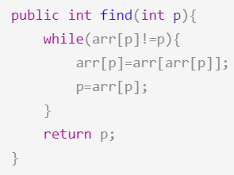
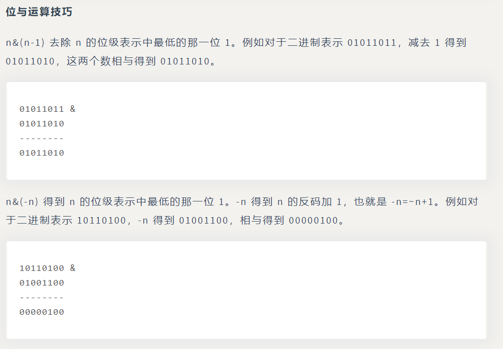
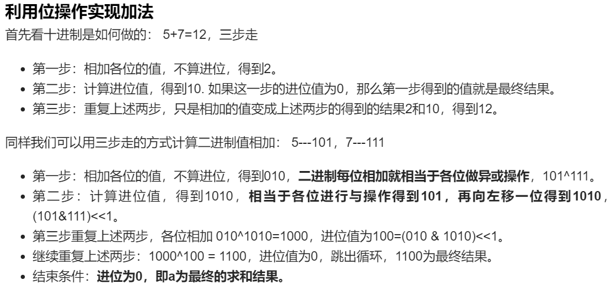

### 图

#### 二分图

#### 1.判断是否为二分图

对于图中的任意两个节点 u 和 v，如果它们之间有一条边直接相连，那么 u和 v 必须属于不同的集合。

如果给定的无向图连通，那么我们就可以任选一个节点开始，给它染成红色。随后我们对整个图进行遍历，将该节点直接相连的所有节点染成绿色，表示这些节点不能与起始节点属于同一个集合。我们再将这些绿色节点直接相连的所有节点染成红色，以此类推，直到无向图中的每个节点均被染色。

如果我们能够成功染色，那么红色和绿色的节点各属于一个集合，这个无向图就是一个二分图；如果我们未能成功染色，即在染色的过程中，某一时刻访问到了一个已经染色的节点，并且它的颜色与我们将要给它染上的颜色不相同，也就说明这个无向图不是一个二分图。

算法的流程如下：

我们任选一个节点开始，将其染成红色，并从该节点开始对整个无向图进行遍历；

在遍历的过程中，如果我们通过节点 u 遍历到了节点 v（即 u 和 v 在图中有一条边直接相连），那么会有两种情况：

如果 v 未被染色，那么我们将其染成与 u 不同的颜色，并对 v 直接相连的节点进行遍历；

如果 v 被染色，并且颜色与 u 相同，那么说明给定的无向图不是二分图。我们可以直接退出遍历并返回 False 作为答案。

当遍历结束时，说明给定的无向图是二分图，返回 True 作为答案。

我们可以使用「深度优先搜索」或「广度优先搜索」对无向图进行遍历，下文分别给出了这两种搜索对应的代码。

注意：题目中给定的无向图不一定保证连通，因此我们需要进行多次遍历，直到每一个节点都被染色，或确定答案为 False 为止。每次遍历开始时，我们任选一个未被染色的节点，将所有与该节点直接或间接相连的节点进行染色。
链接：https://leetcode-cn.com/problems/is-graph-bipartite/solution/pan-duan-er-fen-tu-by-leetcode-solution/

**dfs**

```java
class Solution {
        private static final int UNCOLORED=0;
        private static final int RED=1;
        private static final int GREEN=2;
        private int[] color;
        private boolean valid;
    public boolean isBipartite(int[][] graph) {
        color=new int[graph.length];
        Arrays.fill(color,UNCOLORED);
        valid=true;
        for(int i=0;i<graph.length&&valid;i++){ //要是valid已经false没有必要继续了
            if(color[i]==UNCOLORED){ //不一定全部是连通的。以当前为起点
                dfs(i,RED,graph);
            }
        }
        return valid;
    }
    private void dfs(int node,int c,int[][] graph){
        color[node]=c; //当前染色
        int cNei=c==RED?GREEN:RED;
        for(int neighbor:graph[node]){
            if(color[neighbor]==UNCOLORED){ //邻居没染色
                dfs(neighbor,cNei,graph);
                if(!valid) return;
            }else if(color[neighbor]!=cNei){ //邻居染了但和当前计算出的颜色冲突
                valid=false;
                return;
            }
        }
    }
}
```

**bfs**

```java
class Solution {
        private static final int UNCOLORED=0;
        private static final int RED=1;
        private static final int GREEN=2;
        private int[] color;
    public boolean isBipartite(int[][] graph) {
        color=new int[graph.length];
        Arrays.fill(color,UNCOLORED);
        for(int i=0;i<graph.length;i++){
            if(color[i]==UNCOLORED){ //也和dfs一样，可能不完全都是连通的，选不同的当起点
                Deque<Integer> q=new ArrayDeque<>();
                q.addLast(i);
                color[i]=RED;
                while(!q.isEmpty()){
                    int node=q.pollFirst();
                    int cNei=color[node]==RED?GREEN:RED;
                    for(int neighbor:graph[node]){
                        if(color[neighbor]==UNCOLORED){
                            color[neighbor]=cNei;
                            q.addLast(neighbor);
                        }else if(color[neighbor]!=cNei){
                            return false;
                        }
                    }
                }
            }
        }
        return true;
    }
}
```

#### 拓扑排序

#### 1.课程安排的合法性

参考下一题，连路线都给你求出来了

**dfs**

```java
class Solution {
    // 存储有向图
    List<List<Integer>> edges;
    // 标记每个节点的状态：0=未搜索，1=搜索中，2=已完成
    int[] visited;
    // 判断有向图中是否有环
    boolean valid = true;
    public boolean canFinish(int numCourses, int[][] prerequisites) {
        edges = new ArrayList<>();
        for (int i = 0; i < numCourses; ++i) {
            edges.add(new ArrayList<Integer>());
        }
        visited = new int[numCourses];
        for (int[] info : prerequisites) {
            edges.get(info[1]).add(info[0]);
        }
        // 每次挑选一个「未搜索」的节点，开始进行深度优先搜索
        for (int i = 0; i < numCourses && valid; ++i) {
            if (visited[i] == 0) {
                dfs(i);
            }
        }
        if (!valid) {
            return false;
        }
        // 如果没有环，那么就有拓扑排序
        return true;
    }
    public void dfs(int u) {
        visited[u] = 1; // 将节点标记为「搜索中」
        for (int v: edges.get(u)) { // 搜索其相邻节点
            if (visited[v] == 0) { // 如果「未搜索」那么搜索相邻节点
                dfs(v);
                if (!valid) return;
            } else if (visited[v] == 1) { // 如果「搜索中」说明找到了环
                valid = false;
                return;
            }
        }
        visited[u] = 2; // 将节点标记为「已完成」
    }
}
```

**bfs**

```java
class Solution {
    private List<List<Integer>> edges;
    private int[] indegree;
    private int[] res;
    private int index;
    public boolean canFinish(int numCourses, int[][] prerequisites) {
        edges=new ArrayList<>();
        for(int i=0;i<numCourses;i++){
            edges.add(new ArrayList<Integer>());
        }
        indegree=new int[numCourses];
        for(int[] p:prerequisites){
            edges.get(p[1]).add(p[0]);
            indegree[p[0]]++; //初始化入度
        }
        res=new int[numCourses];
        index=0;
        Deque<Integer> q=new ArrayDeque<>();
        for(int i=0;i<numCourses;i++){ //先把入度为0的进队列
            if(indegree[i]==0) q.addLast(i);
        }
        while(!q.isEmpty()){
            int u=q.pollFirst();
            res[index++]=u;
            for(int v:edges.get(u)){ //u加入结果后，它相邻的节点入度全部减一，如果入度为0，入队列
                indegree[v]--;
                if(indegree[v]==0) q.addLast(v);
            }
        }
        if(index!=numCourses) return false;
        return true;
    }
}
```


#### 2.课程安排的顺序

https://leetcode-cn.com/problems/course-schedule-ii/solution/ke-cheng-biao-ii-by-leetcode-solution/

**dfs**

```java
class Solution {
    // 存储有向图
    List<List<Integer>> edges;
    // 标记每个节点的状态：0=未搜索，1=搜索中，2=已完成
    int[] visited;
    // 用数组来模拟栈，下标 n-1 为栈底，0 为栈顶
    int[] result;
    // 判断有向图中是否有环
    boolean valid = true;
    // 栈下标
    int index;

    public int[] findOrder(int numCourses, int[][] prerequisites) {
        edges = new ArrayList<>();
        for (int i = 0; i < numCourses; ++i) {
            edges.add(new ArrayList<Integer>());
        }
        visited = new int[numCourses];
        result = new int[numCourses];
        index = numCourses - 1;
        for (int[] info : prerequisites) {
            edges.get(info[1]).add(info[0]);
        }
        // 每次挑选一个「未搜索」的节点，开始进行深度优先搜索
        for (int i = 0; i < numCourses && valid; ++i) {
            if (visited[i] == 0) {
                dfs(i);
            }
        }
        if (!valid) {
            return new int[0];
        }
        // 如果没有环，那么就有拓扑排序
        return result;
    }

    public void dfs(int u) {
        visited[u] = 1; // 将节点标记为「搜索中」
        for (int v: edges.get(u)) { // 搜索其相邻节点
            if (visited[v] == 0) { // 如果「未搜索」那么搜索相邻节点
                dfs(v);
                if (!valid) return;
            } else if (visited[v] == 1) { // 如果「搜索中」说明找到了环
                valid = false;
                return;
            }
        }
        visited[u] = 2; // 将节点标记为「已完成」
        result[index--] = u; // 将节点入栈
    }
}

```

**bfs**

```java
class Solution {
    private List<List<Integer>> edges;
    private int[] indegree;
    private int[] res;
    private int index;
    public int[] findOrder(int numCourses, int[][] prerequisites) {
        edges=new ArrayList<>();
        for(int i=0;i<numCourses;i++){
            edges.add(new ArrayList<Integer>());
        }
        indegree=new int[numCourses];
        for(int[] p:prerequisites){
            edges.get(p[1]).add(p[0]);
            indegree[p[0]]++; //初始化入度
        }
        res=new int[numCourses];
        index=0;
        Deque<Integer> q=new ArrayDeque<>();
        for(int i=0;i<numCourses;i++){ //先把入度为0的进队列
            if(indegree[i]==0) q.addLast(i);
        }
        while(!q.isEmpty()){
            int u=q.pollFirst();
            res[index++]=u;
            for(int v:edges.get(u)){ //u加入结果后，它相邻的节点入度全部减一，如果入度为0，入队列
                indegree[v]--;
                if(indegree[v]==0) q.addLast(v);
            }
        }
        if(index!=numCourses) return new int[0];
        return res;
    }
}
```


#### 并查集

可以快速判断图中两个点是否连通

https://cyc2018.github.io/CS-Notes/#/notes/%E7%AE%97%E6%B3%95%20-%20%E5%B9%B6%E6%9F%A5%E9%9B%86

补充一个加权路径压缩



#### 1.冗余连接

题目描述：有一系列的边连成的图，找出一条边，移除它之后该图能够成为一棵树。

因为对于无环图来讲，每合并上一个点上去，都是不同的根在合并，而一旦出现合并的两个点具有同一个根时，说明他俩早已在同一条路径中，故而他两肯定形成环路

所以这题，其实很方便，只要遍历边，将每条边合并上去，一旦出现两个点有同根，则这两个点必定是最后环路形成的闭合位置，也就是我们要找的答案

```java
class Solution {
    public int[] findRedundantConnection(int[][] edges) {
        int n=edges.length;
        UF uf=new UF(n);
        for(int[] e:edges){
            int u=e[0],v=e[1];
            if(uf.connect(u,v)) return e; //两个点早已在一条路径，这条边加上会形成环路
            uf.union(u,v); 
        }
        return null;
    }
    private class UF{
        private int[] id;
        UF(int n){
            id=new int[n+1];
            for(int i=0;i<n+1;i++){
                id[i]=i;
            }
        }
        int find(int p){
            return id[p];
        }
        void union(int u,int v){
            int x=id[u];
            int y=id[v];
            if(x==y) return;
            for(int i=0;i<id.length;i++){
                if(id[i]==x) id[i]=y;
            }
        }
        boolean connect(int u,int v){
            return find(u)==find(v);
        }
    }
}
```


### 位

#### 1.统计两个数的二进制有多少位不同

```java
public int hammingDistance(int x, int y) {
    int z = x ^ y;
    int cnt = 0;
    while(z != 0) {
        if ((z & 1) == 1) cnt++; //不停与1
        z = z >> 1;
    }
    return cnt;
}
```

使用 z&(z-1) 去除 z 位级表示最低的那一位。

```java
public int hammingDistance(int x, int y) {
    int z = x ^ y;
    int cnt = 0;
    while (z != 0) {
        z &= (z - 1);
        cnt++;
    }
    return cnt;
}
```

可以使用 Integer.bitcount() 来统计 1 个的个数。

```java
public int hammingDistance(int x, int y) {
    return Integer.bitCount(x ^ y);
}
```

#### 2.数组中唯一一个不重复的元素

直接全部异或

```java
class Solution {
    public int singleNumber(int[] nums) {
        int res=0;
        for(int num:nums) res^=num;
        return res;
    }
}
```

#### 3.找出数组中缺失的那个数

```java
class Solution {
    public int missingNumber(int[] nums) {
        int res=0;
        for(int i=0;i<nums.length;i++){ 
            res=res^i^nums[i]; //还是异或的思路，看能不能消掉。res^正常所有0到n^数组中的数
        }
        return res^nums.length; //因为包含n(nums.length)，原先用i遍历又取不到，少一个正常n
    }
}
```

#### 4.数组中不重复的两个元素

剑指原题，但这里细节更简洁。



```java
class Solution {
    public int[] singleNumber(int[] nums) {
        int diff=0;
        for(int num:nums){
            diff^=num; 
        } //diff结果就是这两个数异或的结果
        diff&=(-diff); //得到diff位级表示中最低的那一位1，以此将数组分为两部分
        int[] res=new int[2];
        for(int num:nums){
            if((num&diff)==0) res[0]^=num;
            else res[1]^=num;
        }
        return res;
    }
}
```

#### 5.翻转一个数的比特位

```java
public class Solution {
    // you need treat n as an unsigned value
    public int reverseBits(int n) {
        int res=0;
        for(int i=0;i<32;i++){ //遍历32位
            res<<=1; //加下面的结果前先左移一位腾地方，最先进来的逐渐往左靠
            res+=(n&1); //n&1取得当前n的最低位
            n>>>=1;
        }
        return res;
    }
}
```

如果该函数需要被调用很多次，可以将 int 拆成 4 个 byte，然后缓存 byte 对应的比特位翻转，最后再拼接起来。

```java
private static Map<Byte, Integer> cache = new HashMap<>();

public int reverseBits(int n) {
    int ret = 0;
    for (int i = 0; i < 4; i++) {
        ret <<= 8;
        ret |= reverseByte((byte) (n & 0b11111111)); // 这里|=和+=是一样的
        n >>= 8;
    }
    return ret;
}

private int reverseByte(byte b) {
    if (cache.containsKey(b)) return cache.get(b);
    int ret = 0;
    byte t = b;
    for (int i = 0; i < 8; i++) {
        ret <<= 1;
        ret |= t & 1;
        t >>= 1;
    }
    cache.put(b, ret);
    return ret;
}

```

#### 6.不用额外变量交换两个整数

```java
//利用x^x=0和x^0=x
a = a ^ b; 
b = a ^ b; //b=原a^原b^原b=原a^0=原a
a = a ^ b; //此时b=原a，a=原a^原b，a^b=原a^原a^原b=0^原b=原b
```

#### 7.判断一个数是不是2的n次方

是的话二进制表示只有一个 1 存在。

```java
public boolean isPowerOfTwo(int n) {
    return n > 0 && Integer.bitCount(n) == 1;
}
```

还可以利用n&(n-1)去除最低位1后，是不是等于0

```java
public boolean isPowerOfTwo(int n) {
    return n > 0 && (n & (n - 1)) == 0;
}
```

#### 8.判断一个数是不是4的n次方

```java
class Solution {
    public boolean isPowerOfFour(int num) {
        return num>0 && (num&(num-1))==0 && (num&0xaaaaaaaa)==0; //先判断是不是2的幂，4的幂一定是2的偶次幂，1一定在奇数位上，那么num&0b101010...10==0
    }
}
```

也可以用正则表达式匹配

```java
public boolean isPowerOfFour(int num) {
    return Integer.toString(num, 4).matches("10*"); //转4进制，只有一个1
}
```

#### 9.判断一个数的位级表示是否不会出现连续的0和1

说白了就是判断是不是010101，或者101010这种

```java
class Solution {
    public boolean hasAlternatingBits(int n) {
        int a=(n^(n>>1))+1; //是的话n^(n>>1)错位异或后一定是000..1111这种，再加一一定只有一位是1
        return (a&(a-1))==0; //那就去除最低位的1
    }
}
```

#### 10.求一个数的补码

题目描述：不考虑二进制表示中的首 0 部分。

对于 00000101，要求补码可以将它与 00000111 进行异或操作。那么问题就转换为求掩码 00000111。

```java
class Solution {
    public int findComplement(int num) {
        int mask=1<<30; //java只有有符号整数，最高位是符号位，所以mask初始是01000...
        while((num&mask)==0) mask>>=1; //得到最高位1，以上述为例，跳出时mask=00000100
        mask=(mask<<1)-1; //左移再减一得到00000111
        return mask^num;
    }
}
```

可以利用 Java 的 Integer.highestOneBit() 方法来获得含有首 1 的数。

```java
public int findComplement(int num) {
    if (num == 0) return 1;
    int mask = Integer.highestOneBit(num);
    mask = (mask << 1) - 1;
    return num ^ mask;
}
```

#### 11.不用加号实现整数的加法

a^b表示两个数的无进位加法，(a&b)<<1表示进位



```java
class Solution {
    public int getSum(int a, int b) {
        while(b!=0){
            int temp=a^b; //当前和^上轮进位
            b=(a&b)<<1;
            a=temp;
        }
        return a;
    }
}
```

#### 12.字符串数组的最大乘积

```java
class Solution {
    public int maxProduct(String[] words) {
        int n=words.length;
        int[] mask=new int[n]; //每个字符串对应的掩码，其实长度26就够了，只有26个小写字母
        int[] len=new int[n]; //每个字符串对应的长度
        for(int i=0;i<n;i++){
            for(char ch:words[i].toCharArray()){
                int bitnumber=ch-'a'; //该字母在掩码中要置为1的位置。比如'b'掩码右边数起第1位置1（0开始）
                mask[i]|=(1<<bitnumber); //或等不断的添加字母结果。最终比如'abc'的mask[i]就是000...111
            }
            len[i]=words[i].length();
        }
        int res=0;
        for(int i=0;i<n;i++){
            for(int j=i;j<n;j++){
                if((mask[i]&mask[j])==0) res=Math.max(res,len[i]*len[j]); //mask[i]&mask[j]==0表示两个单词无重复字母
            }
        }
        return res;
    }
}
```

O(N^2+L)，L是所有单词总长度。O(N)开了两个数组

感觉判断两个单词有没有重复字母用掩码是一个技巧

也可以使用 HashMap 代替方法一中的两个长度为 N 的数组，存储结构为：位掩码 -> 该掩码对应的最大长度字符串。可以减少单词的遍历。

#### 13.统计从 0 ~ n 每个数的二进制表示中 1 的个数

```java
class Solution {
    public int[] countBits(int num) {
        int[] dp=new int[num+1];
        for(int i=1;i<num+1;i++){
            dp[i]=dp[i&(i-1)]+1; //dp数组中前面的肯定计算过了，i&(i-1)去除最低位的1，那dp[i]个数肯定等于去除1后小的数结果加1
        }
        return dp;
    }
}
```


